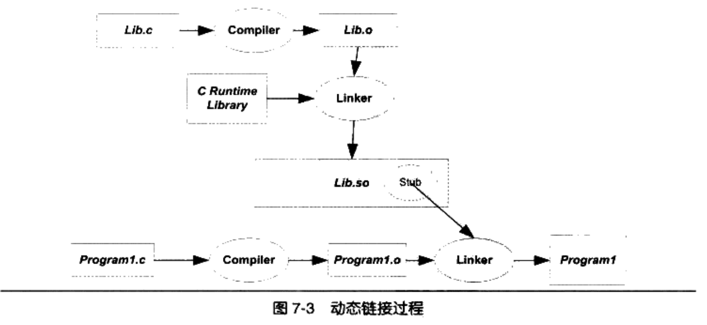
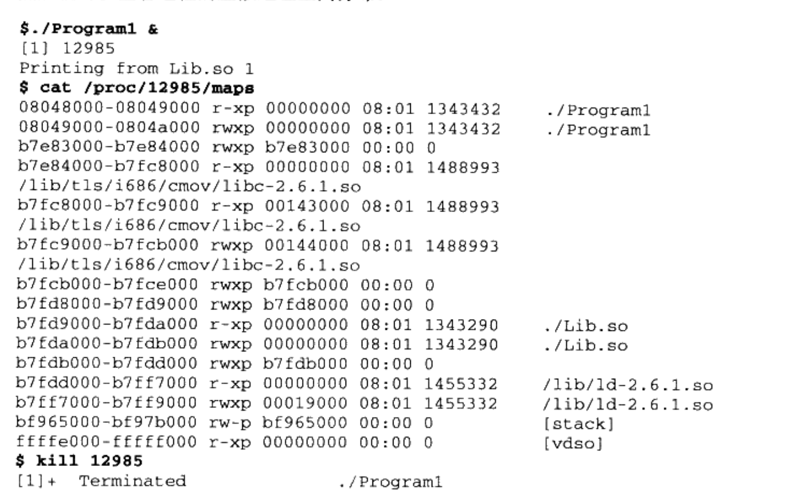
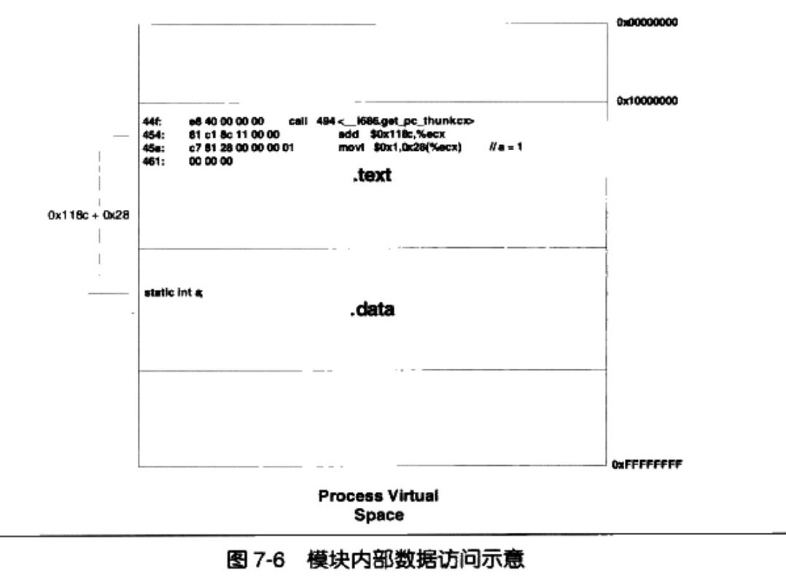
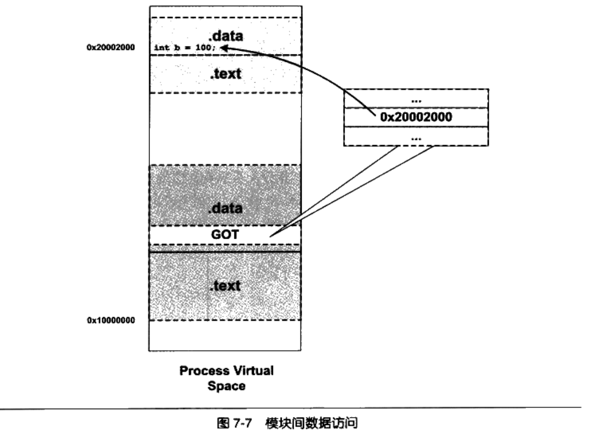
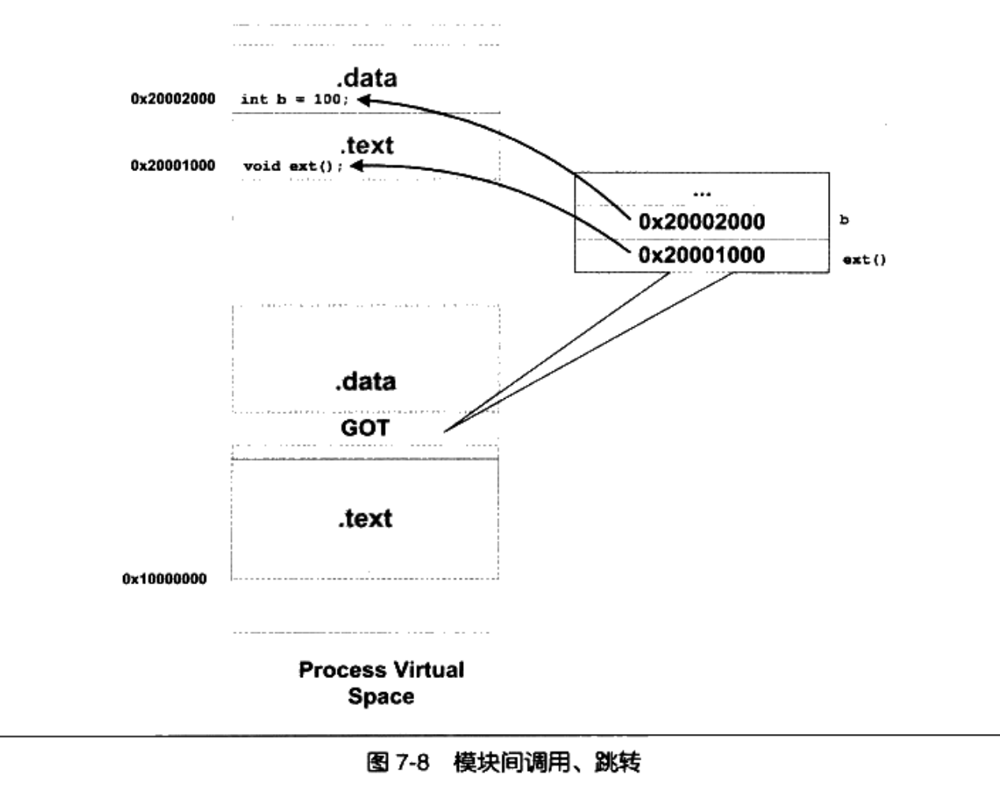
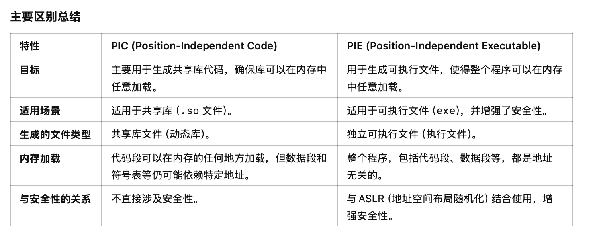
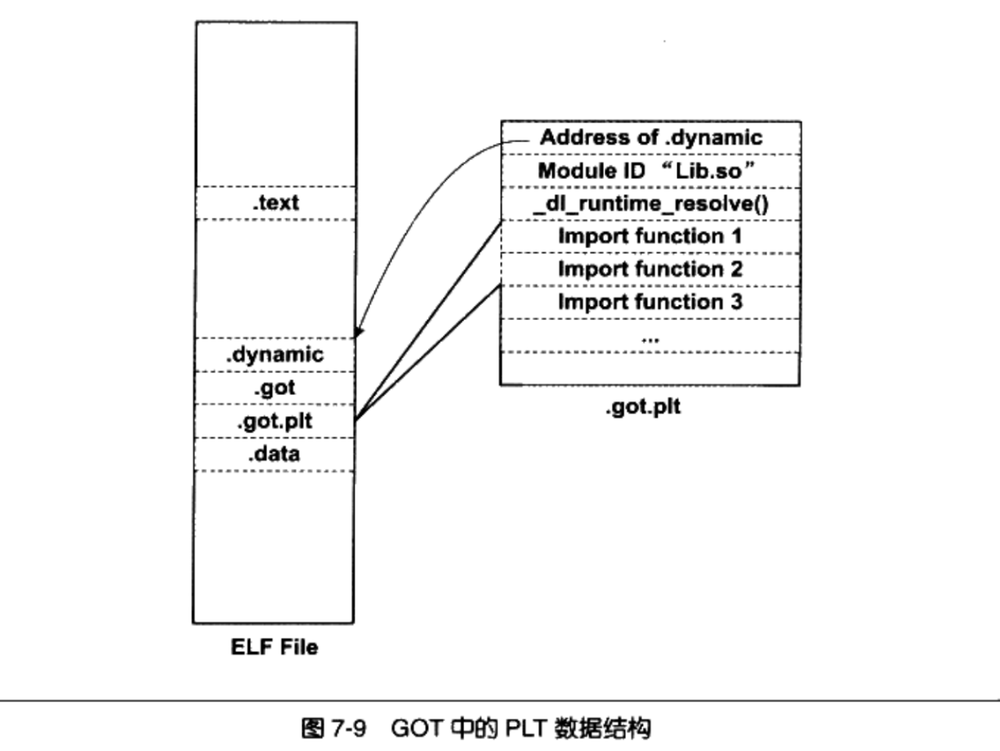
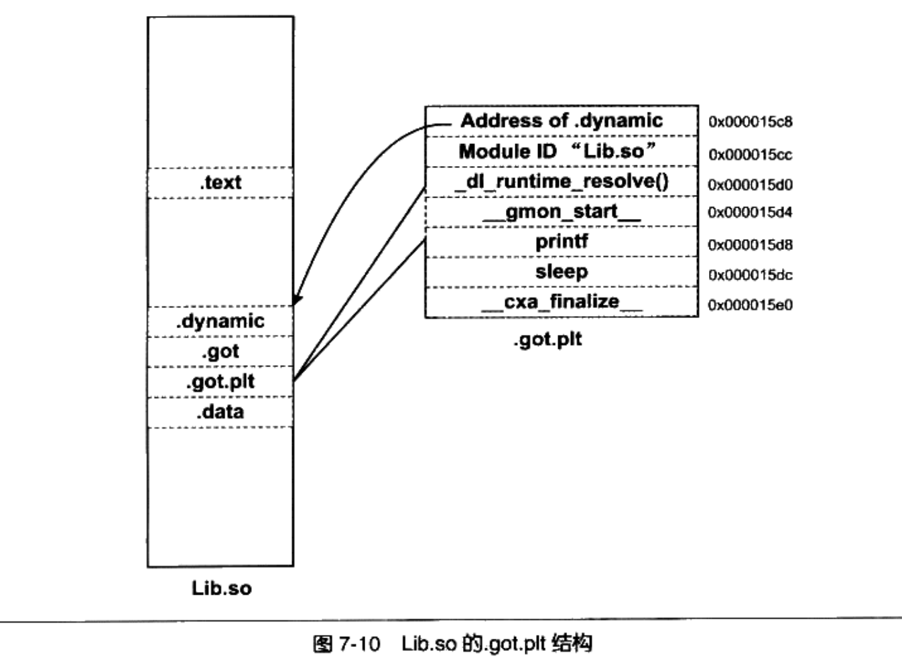

# Chapter7 动态链接

由于静态链接会极大地浪费内存空间，并且第三方库的更新会导致原程序必须重新链接，动态链接出现了。它把链接这个过程推迟到了运行时。在动态链接的基本实现中，它把多个动态链接文件进行链接，而不是直接把目标文件做链接。在Linux中，ELF动态链接文件被称为 **动态共享对象（DSO）**，一般以".so"为扩展名；在Windows中，动态链接文件被称为**动态链接库（DLL）**，一般以".dll"为扩展名。

## 简单的动态链接例子

先以Linux下的ELF动态链接为例。

```c
/* Program1.c */
#include "Lib.h"

int main()
{
		foobar(1);
		return 0;
}
```

```c
/* Program2.c */
#include "Lib.h"

int main()
{
		foobar(2);
		return 0;
}
```

```c
/* Lib.c */
#include <stdio.h>

void foobar(int i)
{
		printf("Printing from Lib.so %d\n",i);
}
```

```c
/* Lib.h */
#ifndef LIB_H
#define LIB_H

void foobar(int i);

#endif
```

用GCC把`Lib.c`编译成一个共享对象文件：

```bash
gcc -fPIC -shared -o Lib.so Lib.c
```

> 参数`-shared`表示产生共享对象，`-fPIC`稍后介绍

分别编译链接`Program1.c`和`Program2.c`：

```bash
gcc -o Program1 Program1.c ./Lib.so
```

```bash
gcc -o Program2 Program2.c ./Lib.so
```

整个编译链接过程如图：



在执行上面的命令时为何需要加上动态链接库`./Lib.so`呢？由于如果不指定，程序内的函数可能会被动态/静态地解释，链接器需要知道这个函数到底应该按静态链接还是动态链接的规则去对地址进行重定位，`Libc.so`中保存了完整的符号信息，链接器会知道：`foobar`是定义在Libc.so中的动态符号，所以必须加上输入`Lib.so`。

### 动态链接程序运行时地址空间分布

可以查看进程的虚拟地址空间分布：



Program1除了用到`Lib.so`外，还用到了C语言运行库`libc-2.6.1.so`。下面被映射的`ld-2.6.1.so`是Linux下的动态链接器。如果用readelf看Lib.so文件的装载属性，可以发现它的装载地址是从0开始，而实际上并不是。这可以说明 **共享对象的最终装载地址在编译时是不确定的**。

## 地址无关代码

由于共享对象在编译时不能假设自己在进程虚拟地址空间中的位置，而可执行文件基本可以确定自己的起始位置，因为可执行文件往往是第一个被加载的文件，可以选择一个固定空闲的地址，如Linux下是0x08040000，Windows下是0x0040000.

### 装载时重定位

为了能使共享对象在任意地址装载，首先想到重定位，即把链接时的重定位推迟到装载时。Linux和GCC支持装载时重定位，使用参数`-shared`,那么GCC输出的共享对象就是用装载时重定位的方法。

装载时重定位有一个重大缺陷：重定位时需要修改动态链接模块的指令部分（比如绝对地址等），会导致不同进程重定位出来的结果不一样，因此没有办法做到同一份指令（进程共享部分）被多个进程共享，必须在每个进程的虚拟地址空间中生成对应的指令副本。

### 地址无关代码

地址无关代码解决了装载时重定位带来的问题，即实现了程序模块中共享的指令部分在装载时不需要因为装载地址改变而改变，实现的基本想法是把指令中需要被修改的部分分离出来，和数据放在一起，这样指令部分就可以保持不变，数据部分可以在每个进程中有一个副本，这个就是地址无关代码（PIC，Position- independent Code）技术。

为了生成地址无关代码，我们可以把共享对象模块中的地址引用按是否跨模块/是指令引用还是数据访问分为四类：

- 模块内函数调用/跳转
- 模块内数据访问，如模块中定义的全局变量/静态变量
- 模块外函数调用/跳转
- 模块外数据访问，如其他模块定义的全局变量

#### 模块内调用或跳转

这种调用是不需要重定位的，因为相对位置永远固定。一般的机器都支持相对地址跳转，所以比较容易解决。但这种方式还会存在一种共享对象全局符号介入的问题，后面再解释。

#### 模块内数据访问

根据任何一条指令与它需要访问的模块内部数据之间的相对位置固定，可以用相对PC的寻址方式找到对应数据。



#### 模块间数据访问

由于跨模块的变量地址需要到装载的时候才能确定，ELF采用了在数据段里建立指向这些变量的指针数组，也就是大名鼎鼎的 **全局偏移表（GOT表）** 。GOT表往往与PLT表（延迟绑定表）共同配合发挥作用，PLT表在后面会详细展开，这里就不详细介绍。每个模块都有对应的GOT表和PLT表。GOT表内容的初始值指向PLT表，内容对应的下标是所有符号的占位符。当模块A尝试访问定义在模块B中的变量`x`时，实际上会去访问`GOT[x]`，然后GOT表会跳转到PLT表，PLT表会把控制权交给动态链接器，让它去解析该符号的具体地址并填入GOT表的`GOT[x]`处。这样，后面A再去访问变量`x`时，都可以直接从GOT表跳转到`x`的实际位置。



#### 模块间调用/跳转

和模块间数据访问类似，也是通过GOT表进行。



#### 小结


#### `-fpic`和`-fPIC`

这是GCC用于产生地址无关代码的参数。两个参数从功能上来看完全一样，区别在于`-fPIC`生成的代码比`-fpic`要大。由于`-fpic`在某些硬件平台上有一些限制，而`-fPIC`没有，故一般都用后者作为参数生成地址无关代码。

#### 如何区分一个DSO是否为PIC

由于PIC的DSO不会包含任何代码段重定位表，所以用命令：

```bash
$ readelf -d foo.so | grep TEXTREL
```

可以查看文件中是否有代码段重定位表，若无输出，则是PIC的。

#### PIC与PIE

地址无关代码既可以用在共享对象上，也可以用于可执行文件。以地址无关方式编译的可执行文件被称作PIE。在GCC中，用`-fPIE`或`-fpie`可以生成PIE。



### 共享模块的全局变量问题

可能会碰到这种情况：

```c
extern int global;
int foo()
{
		global=1;
}
```

当编译器编译 module.c 时，它无法根据这个上下文判断 global 是定义在同一个模块的的其他目标文件还是定义在另外一个共享对象之中，即无法判断是否为跨模块间的调用。

此时代码不会使用PIC机制，链接器会在`.bss`段另外创建一个global变量的副本，也就是说如果global原本是定义在共享对象中的，那么程序在运行时global这个变量就同时存在于两个位置上。

解决方法是把所有用这个变量的指令都指向那个副本。ELF在编译时 **默认把定义在模块内的全局变量当作定义在其他模块中的全局变量，用GOT实现变量访问。** 具体规则如下：

- 当共享模块被装载，某个全局变量在可执行文件中有副本，动态链接器会把GOT中的地址指向该副本
- 若变量在共享模块被初始化，动态链接器会先做复制
- 若全局变量在主模块没有副本，GOT会把地址指向模块内的变量副本

### 数据段地址无关性

数据段是否存在绝对地址引用问题？显然是有的：

```c
static int a;
static int* p = &a;
```

由于数据段在每个进程都有副本，所以可以直接进行装载时重定位，不需要像代码段一样使用地址无关技术。

## 延迟绑定（PLT）

### 延迟绑定实现

很多函数在程序执行完时都不会被用到，比如一些错误处理函数或者是用户很少用到的功能模块等，如果一开始把所有函数链接好非常浪费时间。ELF使用PLT的方法来实现，动态链接器会调用函数解析函数地址，我们假设这个函数为`lookup()`，那么它需要的参数这个地址绑定发生在哪个模块，即`lookup(module,function)`。

PLT为了实现延迟绑定，在跳转到GOT到过程中加了一层跳转。每个外部函数在PLT中都有一个相应的项，比如`bar()`对应的地址称为`bar@plt`，其实现为：

```
bar@plt:
jmp *(bar@GOT)
push n
push moduleID
jump _dl_runtime_resolve
```

> `_dl_runtime_resolve`是Glibc中的`lookup()`实现

首次调用`bar()`时，为了实现延迟绑定，链接器在初始化阶段在GOT表填入的是`push n`的地址，相当于跳到GOT再跳回来。

注意到这个`n`其实是`bar`这个符号引用在重定位表`.rel.plt`的下标。`moduleID`就是模块的ID，接着`_dl_runtime_resolve`会完成符号解析和重定位，然后把`bar()`填入GOT表中。在接下来对`bar()`的调用直接走GOT表即可。

在PLT的真正实现中，ELF把GOT拆分成了两个表叫做`.got`和`.got.plt`，前者用来保存全局变量引用的地址，后者保存函数引用地址。对于后者来说，它的前三项有特殊意义：

1. `.dynamic`段地址
2. 本模块ID
3. `_dl_runtime_resolve()`地址

第二项和第三项是动态链接器负责初始化的，为了减少代码重复，ELF把上面例子中最后两个指令放到PLT中的第一项。



实际的PLT基本结构代码如下：

```
PLT0:
push *(GOT + 4)
jump *(GOT + 8)

...

bar@plt:
jmp *(bar@GOT)
push n
jump PLT0
```

## 动态链接相关结构

在动态链接时，操作系统会先把可执行文件映射到虚拟空间里，映射后由于很多外部符号的引用还处于未重定位状态，故操作系统会启动动态链接器。在Linux下，动态链接器`ld.so`是一个共享对象，OS同样会把它映射到地址空间里，操作系统在加载完动态链接器后就会把控制权交给动态链接器的入口。

### `.interp`段

如何确定动态链接器的位置？它并不是由系统配置指定而是由ELF中的`.interp`段指定。里面保存的就是可执行文件所需要的动态链接器的路径。值得一提的是，这个路径指向的文件`/lib/ld-2.6.1.so`是一个软链接，系统会根据Glibc版本指向对应版本的动态链接器，如Glibc为2.6.1版本，它就会指向`/lib/ld-2.6.1.so`，可执行文件不需要改`.interp`来适应系统升级。

### `.dynamic`段

该段是动态链接过程中最重要的段。它存储了动态链接器所需要的基本信息，如依赖于哪些共享对象/动态链接符号表位置/动态链接重定位表位置/共享对象初始化代码地址等。其结构定义在`elf.h`中：

```c
typedef struct {
		Elf32_Sword d_tag;
		union {
				Elf32_Word d_val;
				Elf32_Addr d_ptr;
		} d_un;
} Elf32_Dyn;
```

其结构由一个类型值和一个附加的值或指针组成（Union类型共享内存）。根据类型的不同，后面的字段的含义也不同：


> `.dynamic`可以理解成静态链接时的ELF文件头

另外，Linux提供了`ldd`命令查看程序依赖的共享库

### 动态符号表

在静态链接中，符号存放在`.symtab`段；而在动态链接中，引入了 **导入导出**的概念。 例如 Program1依赖于Lib.so，引用到了里面的`foobar()`函数，那么对Program1来说，它导入了该函数，`foobar()`是Program1的导入函数，与之对应的，Lib.so导出了该函数，`foobar()`是Lib.so的导出函数。

ELF中的动态符号表（`.dynsym`）就表示了模块间的符号导入导出关系（注意，只保存模块间与动态链接相关的符号）。很多动态链接模块同时拥有`.symtab`和`.dynsym`两个表。

和静态链接类似，动态链接也有一个字符串表`.dynstr`，用于查找符号。对应的，为了加速查找，还有一个`.hash`哈希表。

### 动态链接重定位表

由于 **导入符号** 的存在，共享对象和可执行文件才需要进行重定位。虽然在动态链接的可执行文件用的是PIC方法，但并不意味着它不需要重定位。PIC做的是把代码段中的绝对地址相关的部分分离成GOT，再把GOT放到数据段，让代码段本身不需要做重定位。况且数据段除了GOT之外还会有包含绝对地址的引用，所以数据段是要进行重定位的。

#### 动态链接重定位相关结构

静态链接有`.rel.text`和`.rel.data`两个重定位表；在动态链接中，也有对应的重定位表`.rel.dyn`和`.rel.plt`，分别和静态链接重定位表对应。`.rel.dyn`是对数据引用的修正，其修正位置位于`.got`和数据段；`.rel.plt`是对函数引用的修正，其修正位置位于`.got.plt`。

在静态链接中接触的重定位入口类型就是`R_386_32`和`R_386_PC32`，动态链接中会有新的类型：`R_386_RELATIVE`/`R_386_GLOB_DAT`/`R_386_JUMP_SLOT`。每个重定位类型表示重定位不同的计算方法。对于`R_386_GLOB_DAT`和`R_386_JUMP_SLOT`两个方法都只需要把符号地址直接填入被修正的位置即可。



`R_386_RELATIVE`类型的重定位入口比较复杂，实际上就是Rebasing。对于共享对象数据段的绝对地址引用，必须在装载时做重定位。例如：

```c
static int a;
static int* p = &a;
```

具体来讲，共享对象在编译时的地址从0开始，假设静态变量`a`相对起始地址的偏移为B，即`p`的值时B。若共享对象被装载到A。那么变量`a`的地址就是A+B。这种重定位入口就是专门处理p这种类型的。

---

下面再考虑一个问题，PIC到底是如何影响重定位表的？

如果ELF文件以PIC模式编译，调用了一个外部函数bar，那么bar会出现在`.rel.plt`中（GOT表的存在）；而如果不是以PIC模式编译，bar将出现在`.rel.dyn`中。同时这个函数的重定位入口类型也会从`R_386_JUMP_SLOT`变成`R_386_PC32`。

再进一步，针对`printf("Hello World")`这个函数，如果把代码从PIC改成无PIC时，要对其字符串参数再做一次修正。原因是在PIC时这个字符串可以看作全局变量，它的地址可以通过当前指令位置加上一个固定偏移算出来；但是在非PIC中，代码段用的是绝对地址寻址，所以需要重定位。

### 动态链接时进程堆栈初始化信息

略

## 动态链接的步骤和实现

动态链接的步骤基本分为3步：

1. 启动动态链接器本身
2. 装载所有共享对象
3. 重定位和初始化

### 动态链接器自举

动态链接器本身也是一个共享对象，那么显然，它不能依赖于任何共享对象；且动态链接器本身需要的全局和静态变量的重定位工作由它本身完成。满足这两个条件的过程往往被称为自举（Bootstrap）

自举代码入口即动态链接器入口，它会先找到自己的GOT，然后找到`.dynamic`段，把动态链接器本身的重定位入口全部做重定位。此外，动态链接器也不能调用任何函数，自己的函数也不能调用。

有趣的是，在Glibc2.6.1的`elf.rtld.c`中，有一段注释：

> Now life is sane;we can call functions and access global data.Set up to use the operating system facilities, and find out fromthe operating system's program loader where to find the programheader table in core.Put the rest of  dl start into a separatefunction, that way the compiler cannot put accesses to the GOT before ELF_DYNAMIC_RELOCATE.

### 装载共享对象

自举后，动态链接器会把所有可执行文件和链接器本身的符号表合并，称为全局符号表。在`.dynamic`中，有一种类型入口是`DT_NEEDED`，它是指该文件依赖的共享对象。动态链接器会按某种算法遍历并装载所有共享对象，一般都是广度优先算法。当一个新的共享对象被装载时，它的符号表会被合并到全局符号表，当所有共享对象被装载时，全局符号表就会包含所有所需要的符号。

#### 符号优先级

如果有两个共享对象定义了同一个符号该怎么样链接呢？我们称一个共享对象里面的全局符号被另一个共享对象同名全局符号覆盖的现象时共享对象 **全局符号介入**。在Linux中，使用的是广度优先方法，如果相同的符号名存在，那么后加入的被忽略。

#### 全局符号介入与地址无关代码

由于全局符号介入的问题，地址无关代码技术会比我们前面讲的更复杂一些。对于第一类模块内部调用或跳转的处理时，我们不能简单地当成相对地址调用。由于可能存在全局符号介入的问题，所以编译器会把函数对全局变量的调用都当作模块外部符号处理。

如果要提高模块内部函数调用的效率，可以用`static`定义函数，这样编译器就会使用第一类方法编译。

### 重定位和初始化

接下来链接器会重新便利重定位表并全部做修正。重定位完成后，如果共享对象有`.init`段，那么就会执行这个段中的代码进行初始化（比如C++的全局对象构造），对应的还可能有`.finit`，进程退出时会执行这个段中的代码（如进行C++析构等操作）

> 可执行文件中的初始化段不会由动态链接器执行，而是由程序初始化部分代码负责执行

### Linux动态链接器实现

Linux Kernel执行程序会把控制权交给程序入口，这个入口对于静态链接文件来说就是`e_entry`指定的入口；对于动态链接的可执行文件来说，就是`.interp`段中指定的地址。

Linux的ELF动态链接器时Glibc的一部分，源码位于Glibc的源码的elf目录下，实际入口是`_start()`函数。它的调用位于`elf/rtld.c`的`_dl_start()`函数，它先对`ld.so`做重定位，自举后调用`_dl_start_final`然后进入`_dl_sysdep_start`，接着进入`_dl_main`，这就是动态链接器的主函数。

## 显式运行时链接

动态链接器提供了一些API，供程序自身使用链接，挂载插件等。一共有四个函数，`dlopen`/`dlsym`/`dlerror`/`dlclose`，此处就不展开细节和案例了。
