# Chapter5 服务器端的局域网

> 本章的网络包从互联网出来，即将到达服务器。本章讲着重介绍有关服务器部署、安全、减少负载的方法。具体包含：
>
> 1. 服务器部署地点
> 2. 防火墙的结构和原理
> 3. 将请求平均分配给多台服务器来平衡负载
> 4. 利用缓存服务器分担负载
> 5. 内容分发服务

## 服务器部署

传统的服务器部署地点和方式有三种：公司内网、公司内部的防火墙内以及运营商的数据中心，下面分别展开介绍。

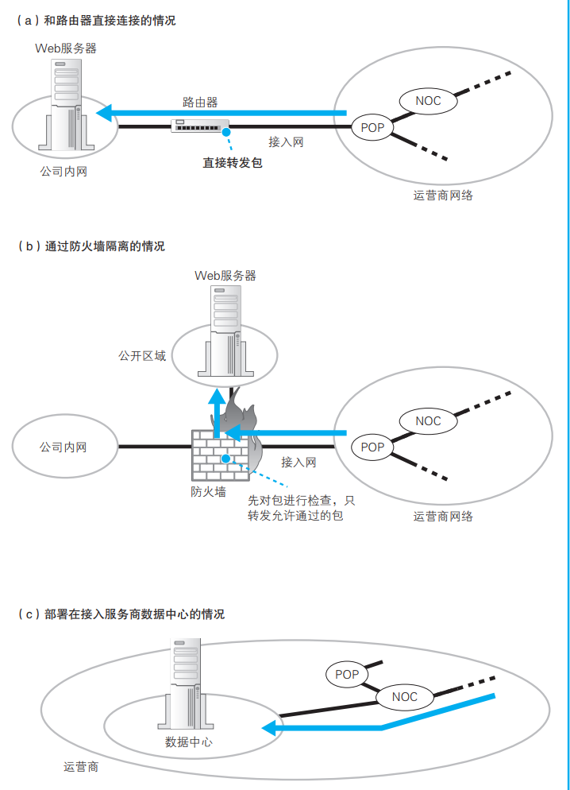

### 公司内部

#### 直接部署在公司网络

目前基本见不到了，有两个主要原因：

1. IP地址不足。如果直接连到内网，那么就要给公司内的所有网络设备分配一个公有IP，这显然是不可接受的。
2. 安全性差。公司内网相当于裸奔在互联网中（其实此时也就根本没有所谓内网的概念了），任何包都会无条件进入公司内网中。

#### 部署防火墙

防火墙能够设置一些规则来屏蔽外部的包，在很大程度上降低了风险，有关防火墙的内容后面会详述。

### 数据中心

这是现在更常见的一种方式，它把服务器放在网络运营商的数据中心内，或者直接租用运营商提供的服务器。

**数据中心**是与运营商核心部分NOC直接连接的，那么自然会带来很多优势：

1. 访问速度高，数据中心直接通过高速线路连接到互联网的核心部分
2. 安全性强，一方面体现在数据中心一般设置在抗震大楼内，有自主发电设备、门禁管理等；另一方面体现在数据中心也有很多附加服务，比如服务器工作状态监控、防火墙的配置和运营、非法入侵监控等

> 在数据中心，用户可以少操很多心，但同时要为服务提供商提供相应费用

## 防火墙的结构和原理

> 防火墙分为包过滤、应用层网关、电路层网关等方式，下面仅介绍包过滤规则下的防火墙实现

### 包过滤规则

根据网络包不同级别的头部信息设置允许包通过（或不通过）的规则，具体来说就是维护一张表。

举一个具体的例子，我们有网络结构如下：

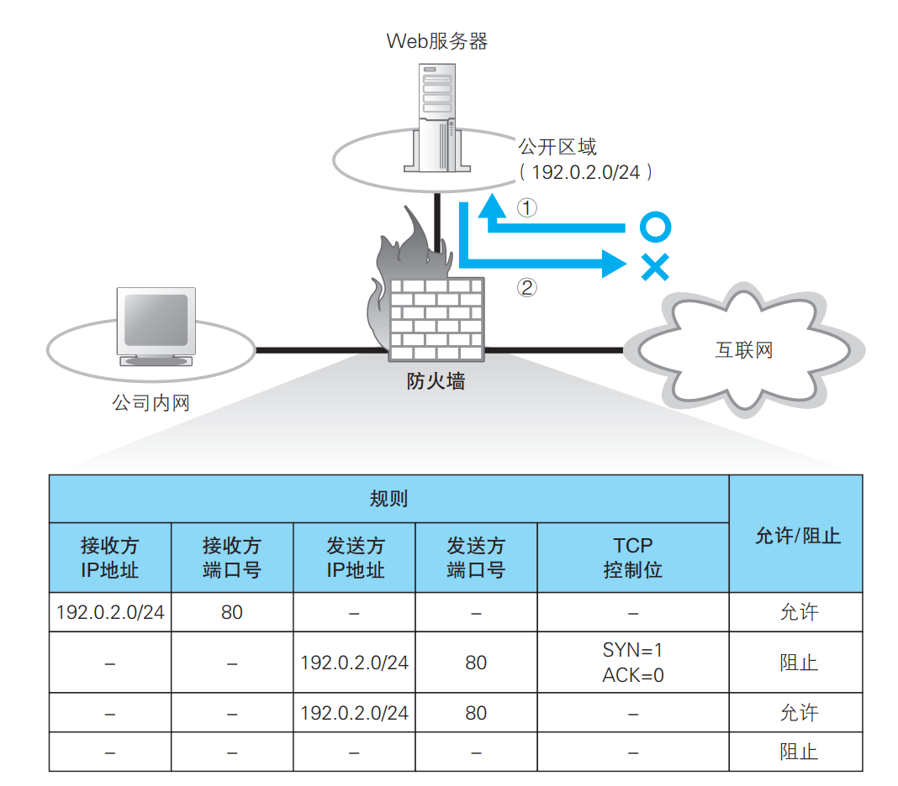

可以看到，通过指定发送方IP,或者接收方IP，可以完成指定方向包的接收和发送。但这显然是不够的，我们还需要根据更多信息做出限制。

#### 通过端口号限定应用程序

如果只指定IP，相当于发送给这个服务器的包可以访问服务器上的所有内容。通过对TCP/UDP协议头部的端口号再做限定，就可以实现只对指定应用程序接收包了。

#### 通过控制位判断连接方向

这个应用场景是我们往往需要组织Web服务器向互联网发包，因为有些病毒是会从服务器中向外泄露去传染其他服务器的，只要禁止服务器向互联网发包就可以大大降低病毒传染的机会。

通过TCP的握手机制可以实现这一点。我们知道TCP协议中，发包者会进行三次握手，收包者会进行四次握手，且发包者发出的第一个包中TCP控制位的SYN为1，ACK为0.通过这个信息，我们对从服务器发出的，SYN=1&& ACK=0的包做拦截，只要拦下第一次握手，后面也就不可能进行握手了。

> 需要注意的是，UDP没有握手机制，也就是说，基于UDP协议实现的如DNS服务器防火墙不能实现上述功能。这种情况下，要么允许全部包通过，要么牺牲便利性组织该应用的所有包通过；当然也可以抛弃包过滤方式，用其他方式实现防火墙，完成UDP协议下的连接方向判断功能。

> 当然，头部信息有非常多，通过对这些信息的组合，我们就可以实现对网络包非常细的筛选

#### 防火墙下的地址转换

包过滤机制的防火墙同时能实现地址转换的功能。根据上一章内容，互联网和公司内网之间的包需要地址转换才能传输，设置方式和包过滤一致，以起点和终点作为条件即可。

具体地说，由于互联网路由器的路由表中没有私有地址的路由，所以所有接收方为私有地址的包全部会被丢弃，这就是为什么要用地址转换的原因。在防火墙中，用户可以配置地址转换机制，让内网访问公司公共区域时直接用内网IP访问，这两个区域内的包不需要进行地址转换。

### 防火墙的缺陷

从上述机制的说明中，我们可以看出防火墙的功能仅仅是根据起点、终点等一系列规则来判断包是否能通过，对其中数据的安全性没有做任何检查，一旦遇到有危险的包，服务器可能就会宕机。解决方法：其实这个问题的根源在于服务器有BUG,这种Bug往往会被作为高位安全漏洞公布出来，开发者会立即进行修复。其次，现在也有一些软件能提供检查包的内容的功能，它们常常被作为防火墙附件提供。

## 通过将请求平均分配给多台服务器来平衡负载

服务器访问量上升时，我们不能仅通过增加服务器带宽、提升服务器性能来解决问题，我们需要更有效的方法，这就是平衡负载的目的。

显然，我们可以通过用多台服务器来分担负载，这也叫做分布式架构，下面介绍分布式架构的具体实现方式

### 轮询机制

通过DNS服务器实现，即在DNS服务器中在同一个域名处写入不同服务器的IP，每次查询时让DNS服务器按顺序返回不同的IP地址。用这种方式可以简单地把访问平均到所有服务器上。

但是轮询机制是有很大缺陷的，比如当有一台服务器宕机时，DNS服务器是不会知道这件事的，仍然会把负载平衡到那台宕机的服务器中，会出现很大问题。其次，在需要用CGI方式动态生成的网页中，有些操作是要跨界面的，如果此时访问的服务器发生变化，就无法继续这个操作。比如在购物网站中，可能会在第一个页面输入地址和姓名，第二个页面输入卡号。

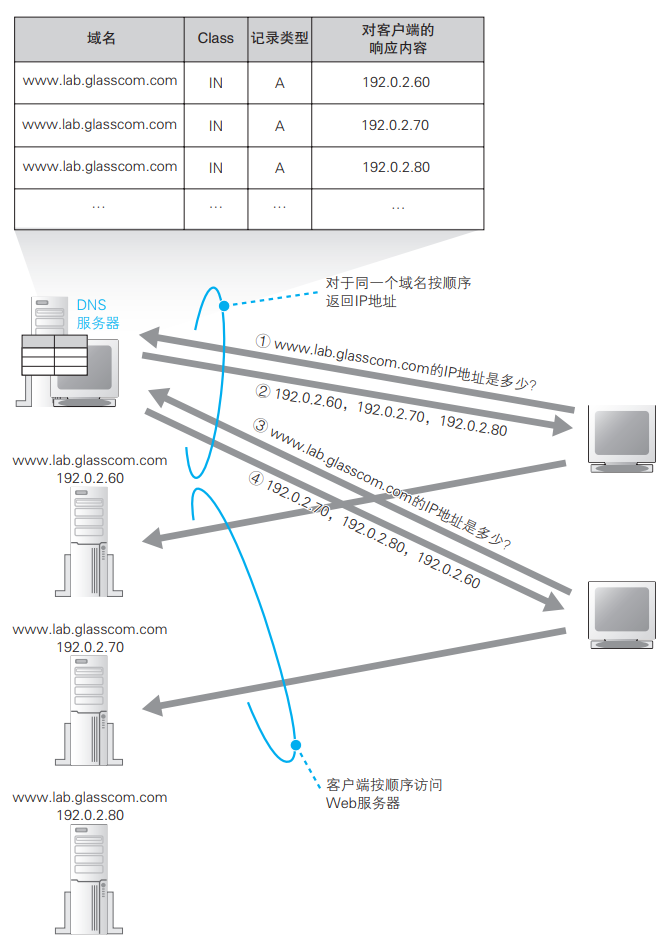

### 负载均衡器

看到轮询方式的问题后，我们自然要想，这是因为轮询平衡负载是在DNS服务器上做的，如果把平衡负载做在更近的地方是否可以解决问题？负载均衡器就是这么做的，它首先在DNS中唯一绑定这个域名，然后进行请求转发操作。

> 转发请求消息用的是后面的“代理”机制

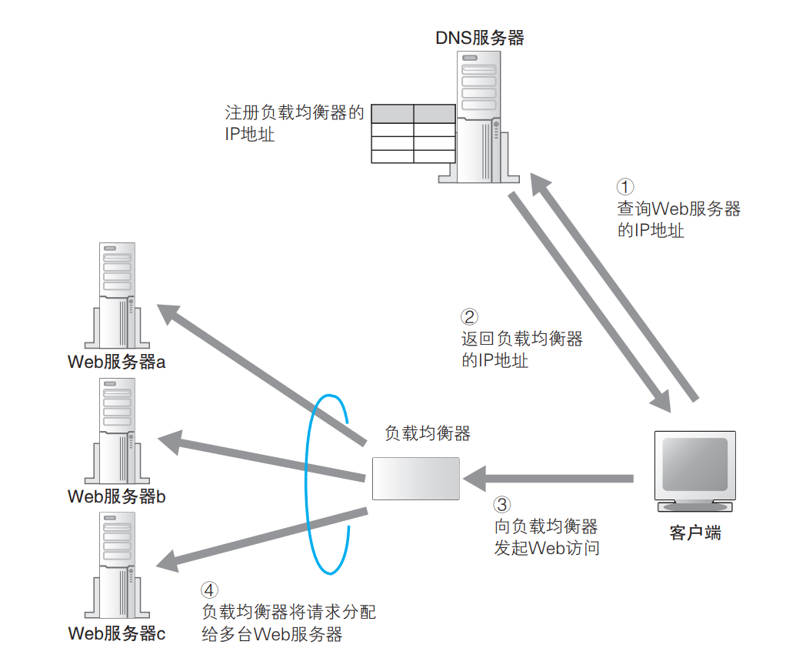

使用负载均衡器方式的关键在于，如何判断将请求转发给哪台服务器。

- 操作没有跨多页面：根据服务器负载情况判断，可以通过定期采集CPU、内存使用率，也可以向服务器发送测试包，根据响应时间判断。当然，这些采集和测试操作也会在一定程序上增加服务器负载，还有一种方法是先设置服务器的性能指数，按比例来分配请求
- 操作跨多页面：这种情况下，必须把请求发送到同一台服务器上。要实现这一点，关键是我们怎么判断一个操作是否跨越了多个页面。HTTP在设计时是没有考虑到请求的相关性的，所以这是难以判断的。后来，为了解决这个问题，我们需要保存访问的状态，伟大的Cookie产生了。

## 使用缓存服务器分担负载

> 上面介绍的是使用多台功能相同的服务器分担负载，接下来介绍的是把整个系统按功能分成不同的服务器，比如Web服务器、数据库服务器等。

**缓存服务器** 是一台通过 **代理** 机制对数据进行缓存的服务器。代理介于服务器和客户端之间，具有中转访问的功能。进行中转时，它可以把Web服务器返回的数据保存在磁盘中，代替服务器把磁盘中的数据返回给客户端。这有两个好处：一是提高访问速度，二是减小服务器负载。

### 缓存服务器通过更新时间管理内容

下面讲缓存服务器工作的具体过程

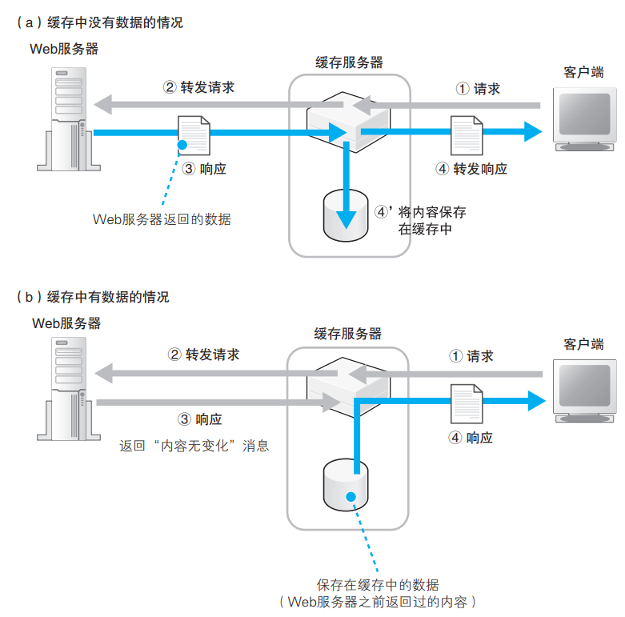

缓存服务器和负载均衡器一样都需要代替服务器被注册到DNS服务器中。如果发现发送来的包不在缓存中，会在HTTP头部添加一个Via字段，表示这个信息经过缓存服务器转发，然后将信息发送给服务器。如果缓存服务器中存了很多Web服务器的信息，就要判断转发给谁。比较有代表性的方法是根据URI中的目录名来判断，如

- 当URI为/dir1/时，转发给www1.lab.glasscom.com
- 当URI为/dir2/时，转发给www2.lab.glasscom.com

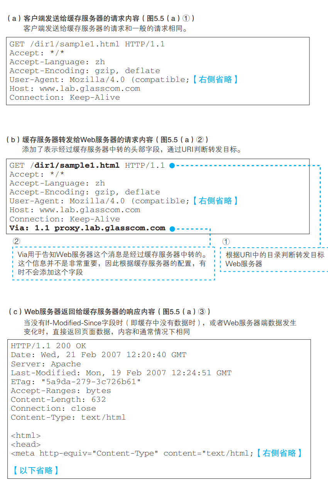

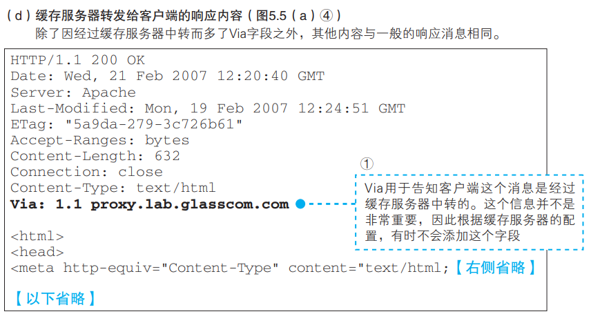

下面讲访问请求在缓存中的情况（命中缓存）。

首先，接收请求然后添加一个If-Modified-Since头部再转发给Web服务器，询问服务器请求内容是否发生变化。然后，如果没有变化，服务器就会返回一个表示没有变化的响应消息。这时，服务器只需要查询一下数据的最后更新时间即可，这比返回页面数据的时间小，且返回内容更短。如果内容有变化，那么和没有命中缓存的操作是一样的。

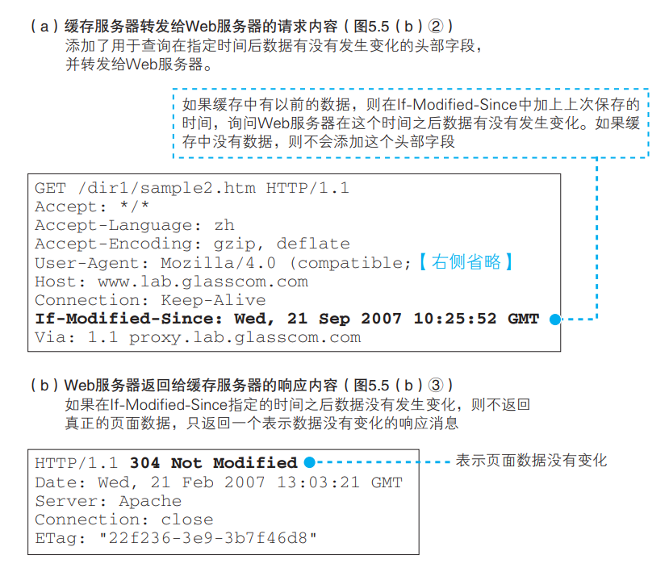

### 正向代理

刚刚讲的是部署在服务器端的代理，其实更原始的代理是在客户端部署的，称作**正向代理**。

正向代理在刚刚出现时有两个用途：缓存、实现防火墙

> 代理出现于ADSL FTTH实用化之前，那时还没有高速廉价的接入网，因此必须想办法榨干低速接入网中的所有能力

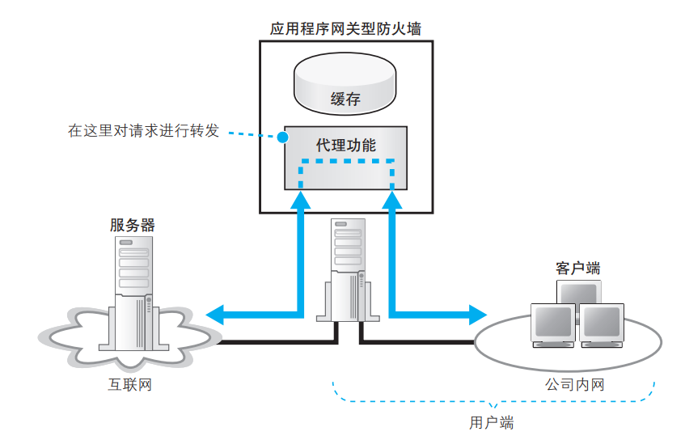

此外，由于代理在转发过程中可以查看请求内容，可以通过代理禁止员工访问危险网站，这是包过滤方式防火墙做不到的。

在使用正向代理时，需要在浏览器的设置里填写正向代理的IP,在没有设置正向代理时，浏览器会根据输入的URL直接发包；有正向代理时，浏览器会直接向代理服务器发包，并且把完整的URI填在包中。

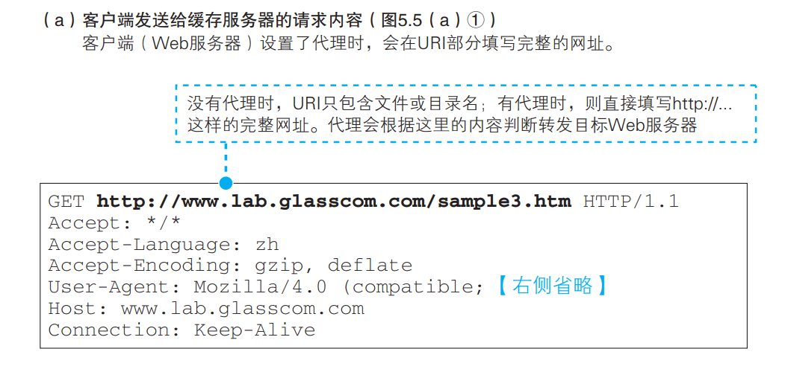

### 反向代理

这是正向代理的改进版，实现了不需要在浏览器中设置代理。也就是说，通过将请求中的URI的目录名和Web服务器进行关联，使得代理能够转发一般的不包含完整网址的请求，这一点和前面提到的服务器端代理是一致的。

### 透明代理

更加方便的方式，看IP头部中的IP地址（在HTTP 1.1中，还可以看Host字段），这种方式既不需要在浏览器设置代理，也不需要在缓存服务器上关联目录和Web服务器。但是透明代理的问题在于，如何让包发给它，由于浏览器没有设置，且无法向反向代理那样通过DNS解析引导方法实现，我们采用的方法是在包转发的路径上安置透明代理（一般让包设计成只有一条路，否则需要在所有路上都设置透明代理），用户在发包时根本不会注意到透明代理的存在，这也就是它名字的由来。

## 内容分发服务

### 利用内容分发服务平衡负载

上面分别讲述了在服务器端和客户端部署缓存服务器的方式，它们各有利弊：

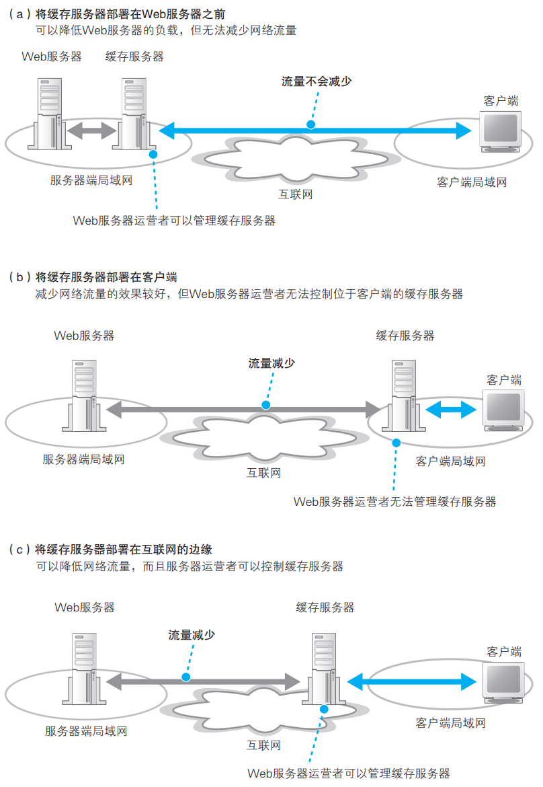

通过让Web服务器运营者和网络运营商签约，可以把自己控制的缓存服务器部署在客户端的运营商处。一个很现实的问题是，作为一个服务器运营者，如果自己和运营商都签约，那么费用和精力上都是不可接受的，此时就出现了专门负责提供部署缓存服务器的厂商，这种服务被称作 **内容分发服务**，这些厂商称为CDSP

> 内容分发服务就是现在我们熟悉的CDN

一方面，CDSP会和供应商签约，部署很多缓存服务器；另一方面，它们会和web服务器的运营者签约，由于CDSP的缓存服务器可以给多个运营者共享，那么平均成本就低了，同时精力上也小了。

### 如何找到最近的缓存服务器

#### 用DNS服务器来分配访问

首先，需要先从缓存服务器中的路由器收集路由信息，把所有路由器的路由表集中到DNS服务器上。然后，DNS服务器根据路由表查询从本机到DNS查询消息的发送方的路由信息。通过互联网内部的路由表，可以大致估算出距离。

#### 通过重定向服务器分配访问

利用HTTP头部的Location字段引导客户端访问到另一台服务器上，这个过程叫做 **重定向**。重定向服务器也要先注册到DNS服务器中，然后和上面做一样的工作，收集路由表，估算距离，分配访问。缺点是增加了HTTP消息的交互次数，开销增大。优点是估算距离的精度增高（因为DNS服务器扩展的方法是估算客户端DNS服务器到缓存服务器的距离，而重定向法是根据客户端发来的发送方IP来估算距离的）

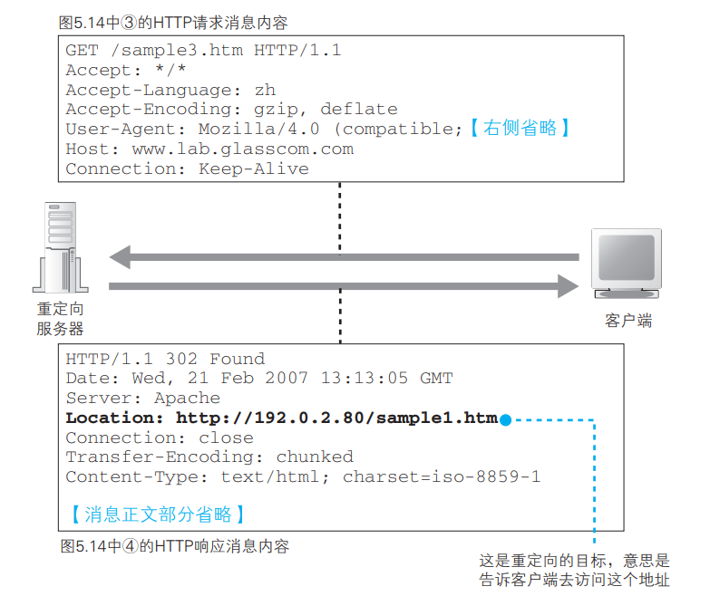

### 缓存的更新方法也会影响性能

对原始的缓存方法做更新和优化，比如在Web服务器的原始数据发生更新时立即通知缓存服务器，让缓存服务器的内容一直保持最新状态，这也就不用每次确认原始数据有无变化了。此外还需要注意，由CGI程序生成的动态页面是不能保存在缓存服务器中的，可以把动态和静态部分分开，只保存静态部分。