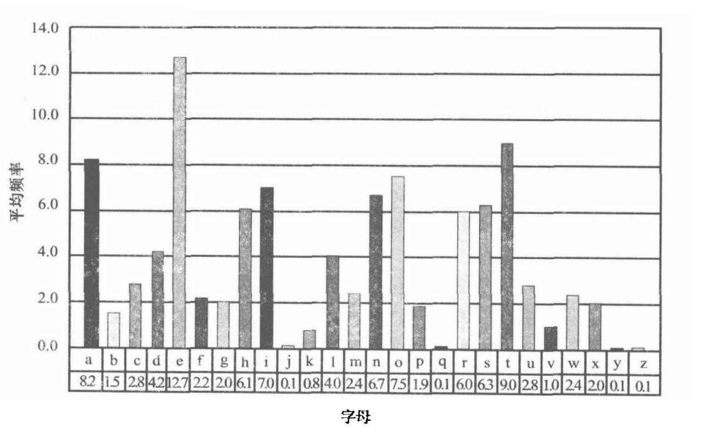

!!! info "课程考核标准"

    考勤10%，作业10%，期中考30%，期末考50%

# Lec1 Introduction

!!! info "Absract"

    本讲对现代密码学的定义做了介绍，阐述了Kerckhoffs原则，同时介绍了一些古典密码，最后讲了现代密码学的基本原则。

    Key words: Syntax; Kerckhoffs原则; 古典密码; 基本原则

### 加密语法

1. $Gen(.)\rightarrow sk$,密钥生成算法，Randomized Algorithm
2. $Enc(sk, M)\rightarrow C$,加密算法，R/D
3. $Dec(sk, C)\rightarrow M$,解密算法，Deterministic Algorithm

### 明文空间与密钥空间

用$M$代表明文空间，是所有被加密算法支持的消息的集合

用$K$代表密钥空间，是密钥生成函数输出的所有可能密钥的集合

任何一个加密方案都可以通过明确算法（$Gen,Enc,Dec$）与明文空间$M$来定义

!!! note " 攻击场景"

    - Ciphertext-only attack：唯密文攻击，这是最基本的攻击，即对手只观察一个密文（或多个密文），并试图确定相应的明文（或者多个明文）。

    - Known-plaintext attack：已知明文攻击，对手能够学习一个或多个使用相同密钥加密生成的明文/密文对。目标是确定其他密文对应的明文。

    - Chosen-plaintext attack：选择明文攻击。在这种攻击中，对手可以选定明文，并知道对应的加密得到的密文。目标是确定其他密文对应的明文。

    - Chosen-ciphertext attack：选择密文攻击，对手甚至可以选择密文并得到相应的明文。对手的目的依旧是确定其他密文的明文（其明文不能直接得到）。

    防范密码学攻击方式的难易程度：选择密文攻击 > 选择明文攻击 > 已知明文攻击 > 唯密文攻击

    四种密码攻击方式中破解难易度：唯密文攻击 > 已知明文攻击 > 选择明文攻击 > 选择密文攻击

### Definition of "CorrectNess"

$$
\forall m \in M,\Pr\limits_{sk\leftarrow Gen}[Dec(Enc(sk, m))=m]=1
$$

### Kerckhoffs原则

安全性仅依靠于**密钥**的安全性，即**加密方案本身不需要保密**，唯一需要保密的是通信双方共享的密钥

**优点有三：**

1. 相比维护算法的保密性，维护一个短小密钥的保密性更容易
2. 即使密钥暴露，参与方也可以很容易地修改密钥而不是替换算法
3. 假设在公司中有多个人员需要加密通信，用不同的密钥比用不同算法更有可操作性

> Tip: 对于对称加密，我们必须假设通信方可以使用某种秘密的方式建立初始的共享密钥

### 古典加密

#### Caesar加密

只平移三个字母，没有密钥，无安全性可言。

> 有一种加密方式 **ROT-13**,是凯撒加密的一个变种，它同样没有密钥，只是简单地将每个字母移位13位，如今仍在某些论坛被频繁使用

后面优化的移位加密在0-25中随机选择一个整数进行移位，如用密钥$k$加密明文字符$m_i$，可以得到密文字符$[(m_i + k) \bmod{26}]$，解密密文字符$c_i$，则为$[(c_i - k) \bmod{26}]$.但由于这个方法的密钥空间过小（26个数字），可以轻松被暴力(Brute-Force)枚举破解，故也无安全性

> 密钥空间充分性原则：任何安全的加密方案必须拥有一个能够抵御穷举搜索的密钥空间 （安全的必要条件）

#### Substitution加密

单字母替换，每一个字符都映射到一个不同的密文字符上，这样的密文空间$K$就有$26!$，约为$2^{88}$，在这种方法下，"Brute-Force attack is impossible".但是，由于:

(1) 每个字符的映射是固定的；

(2) 英文中单个字母的概率分布是已知的。

所以，可以对映射后的密文的概率分布做分析，再根据“有意义的明文”这一结果导向，从而逐一推出明文。

进一步思考，如果一个非常大且复杂的文本，人为判断“语言是否有意义”是一件非常繁琐的事，换句话说，有没有方法去量化“有意义的明文”这个结果导向。根据已知的概率分布，令$p_i\ \ (0<i<25)$表示英文中第$i$个字母的概率，可以计算：
$$
\sum\limits_{i=0}^{25} {p_i^2} \approx 0.065
$$
然后对于密文来说，令$q_i$表示密文中第$i$个字符出现的概率，若密钥为$k$，那么期望对于每个$i$，$q_{i+k} \approx p_i$ （此处省略模26）。对应地，如果对每个$j \in {0, \cdots , 25}$,计算：
$$
I_j = \sum\limits_{i=0}^{25} p_i\cdot q_{i+j}
$$
这样，对于所有的$j$，计算对应的$I_j$，并输出所有接近$0.065$的结果当作密钥即可

> 上述古典加密的攻击场景均为唯密文攻击，如果敌手能够执行已知明文攻击，那么上述加密将被直接攻破

### 现代密码学的基本原则

> 强调定义、假设和证明是现代密码学与经典密码学的区别

1. Formal Security Definition:公式化的表述，严格且精确的安全定义
2. Precise Mathematic Assume:当安全性依赖于假设时，它必须被精确陈述，且假设必须尽量少
3. Proof of Security(Reduction):归约，有严格的安全证明

#### Principle 1: Formal Definitions

**解决任何密码学问题的第一步是公式化的表述和精确的安全定义**。形式化的安全定义是设计、使用或者研究任何密码学原语或者协议的基本先决条件。

**如何定义安全？**

一言以蔽之，如果**特定能力的对手**无法实现**特定的破解**，则给定任务的加密方案是安全的

#### Principle 2: Precise Assumptions

大部分现代密码学的构造方案不可能证明为无条件安全。所以安全依赖于某种假设，第二个原则就是：**假设必须被精确地陈述**。

#### Principle 3: Proofs of Security

**归约方法**

给定一个如下形式的定理：
$$
若给定假设X是正确的，根据给定的定义，构造方案Y是安全的
$$
那么证明通常会展示：如果将假设$X$归约到攻破构造方案$Y$，即如何用敌手攻破方案$Y$的方法导致一个与假设$X$的冲突
