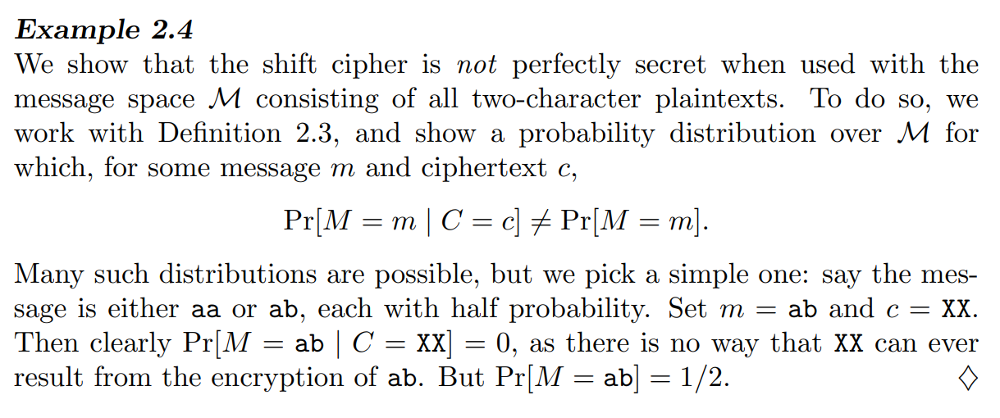
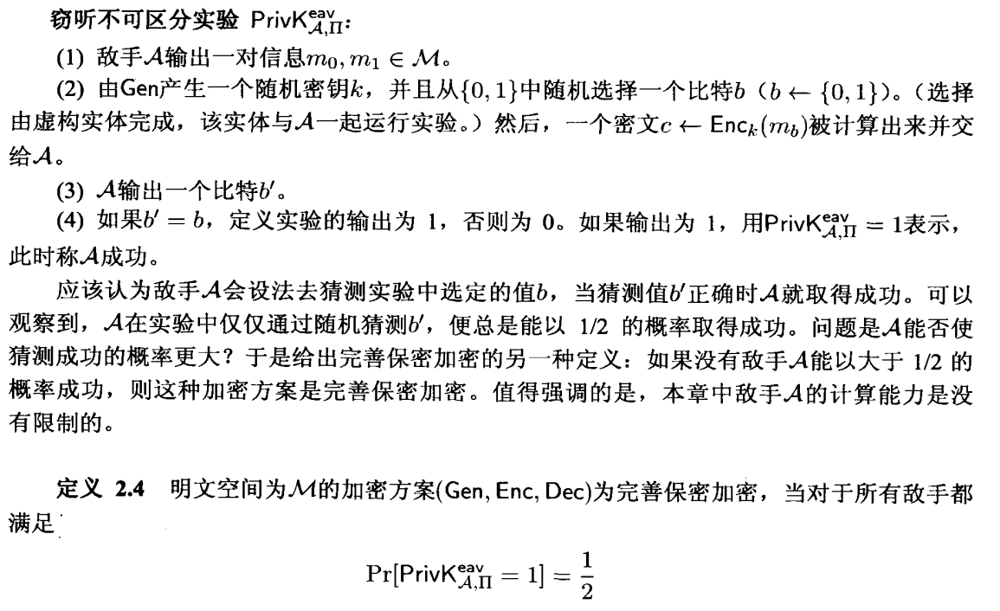
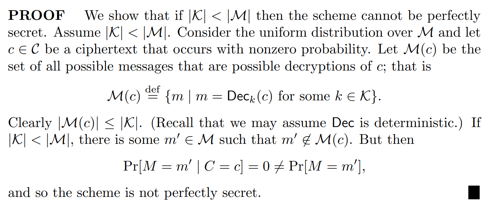

# Lec2 Perfect Privacy

!!! info "Abstract"

    上一讲介绍了一些古典加密方案以及如何用很少的计算量去完全破解它们。本讲开始讨论另一个极端，研究可证明安全的加密方案，甚至可以抵御有无限计算能力的攻击者，这种方案被称为 “完善保密加密”

    Key words: Perfect Privacy; Shannon Privacy; Provable Security

## Definition of Perfect Privacy

通过逐步尝试，调整约束来实现一个较好的定义

> 需要明确，Perfect Privacy定义的攻击场景在唯密文攻击下，且攻击者仅仅不知道双方共享的密钥

### Attempt1

> During the communication, $sk$ is totally Secure

问题在于虽然保证了$sk$的绝对安全性，但根据$Enc(sk,M)=C$，加密后的文本仍然会被第三方得知，而第三方可以通过对密文的分析得到额外的信息，从而泄露原文

### Attempt2

> During the communication,$Msg$ is totally Secure

第二种方法弥补了第一种的缺陷，直接保证$Msg$绝对安全，但这种方法"too good to be true"，难以实现

### Attempt3

> During the communication,the adversary **Cannot** obtain **"additional"** information of Msg

这是由Shannon在1949年提出的定义，数学化的表述是：

Given $\pi=(Gen(),Enc(),Dec(),M,K)$,we say $\pi$  is  Shannon Privacy with respect to  Distribution $D$
$$
If\quad \forall t\in M,\ c\in C,\ \Pr\limits_{M\leftarrow D}[m=t]=\Pr\limits_{M\leftarrow D,sk\leftarrow Gen()}[m=t\mid Enc(sk,m)=c]
$$
其中，等式左侧称为先验(priori)概率，右侧称为后验(posteriori)概率，直观地解释就是在了解到加密过程和密文后，仍然不会影响第三方判断出原文的概率，即密文没有泄露任何明文信息。

除此之外，还有
> we say $\pi$ is Shannon Privacy if it works for all Distribution

这里的分布指的是明文空间中消息的分布（这个分布一般是公开的，参考26个英文字母在文段中出现的频率也是可以计算的）

> 值得一提的是，移位密码只在加密单个字符的时候是满足完美安全的
>
> 

### Attempt4

它的定义为：

$\forall msg$, the distribution of Ciphertext is always identical.
$$
\Leftrightarrow \forall m_1,m_2\in M,c\in C,\Pr\limits_{sk\leftarrow Gen()}[Enc(sk,m_1)=c]=\Pr\limits_{sk\leftarrow Gen()}[Enc(sk,m_2)=c]
$$
在这个定义中，与香农的定义的最大区别在于它**不考虑明文空间的分布**，即敌手不需要知道明文空间的分布。而香农的定义中，需要考虑明文空间$M$的分布。一言以蔽之，在这种定义下，密文的分布不依赖于明文。显然，这个定义下敌手需要知道的信息就会少一些，实现难度比前者在直觉上要简单。

那么自然会提出，这两个安全之间有没有联系，如果4能够在一定程度上代替3，那就再好不过了。

幸运的是，可以证明定义3与4完全等价

Theorem: let $\pi=(Gen(),Enc(),Dec(),sk,M)$ be an encrption Scheme,$\pi$ is Shannon Privacy Iff $\pi$ is Perfect Privacy

!!! note "补充证明"

    下面补充这条定理的证明

    引理:

    $$
    \forall D,m\in M,c\in C,\ Pr[C=c\mid M=m]=Pr[C=c]
    $$

    引理的证明省略
 
    $Proof:$由引理得
    $$
    Pr[C=c\mid M=m_0]=Pr[C=c]=Pr[C=c\mid M=m_1]
    $$
    必要性证毕
    
    充分性:假设对任意$M$上的概率分布，每个$m_0,m_1\in M$和每个$c\in C$,满足
    $$
    Pr[C=c\mid M=m_0]=Pr[C=c\mid M=m_1]
    $$
    选定某个$M$上的分布，对任意的$m_0\in M$和每个$c\in C$，定义$p=Pr[C=c\mid M=m_0]$
    
    由于对所有$m$,有$Pr[C=c\mid M=m]=Pr[C=c\mid M=m_0]=p$,于是有

    $$
    \begin{align}
    Pr[C=c]&=\sum\limits_{m\in M}Pr[C=c\mid M=m]\cdot Pr[M=m]\\ 
    &=\sum\limits_{m\in M}p\cdot Pr[M=m]\\ 
    &=p\cdot \sum\limits_{m\in M}Pr[M=m]\\ 
    &=p\\
    &=Pr[C=c\mid M=m_0]\\
    \end{align}
    $$
    
    因为$m_0$是任意选择的，对所有$c\in C$和$m\in M$，都有$Pr[C=c]=Pr[C=c\mid M=m]$成立。证毕

### Further Discussion

值得一提的是，完善保密加密的另一个等价定义称为 **完美不可区分性（Perfect indistinguishability）** 或者**敌手不可区分性（Adversarial indistinguishability）**，课上并没有在这里介绍，但是会在后面几讲中频繁用到。这个定义基于一个涉及敌手$A$的实验，并形式化定义$A$不可达到的能力，即$A$不能区分出密文是来自哪个明文。这个定义将作为七点引出下一章计算安全的概念。在本课程中，也经常用 **实验** 定义安全性。它本质上是敌手和虚构的测试者之间的游戏：

> 但请注意，完美安全中的敌手不可区分性实验中，敌手的计算能力被视为无限大

**可以证明，完美不可区分性和Perfect Privacy等价**

## The One-Time Pad

介绍了一种基于Perfect Privacy的实现，**一次一密(One time pad)**

定义：

(1) 令整数$l>0$，设明文空间$M$，密钥空间$K$和密文空间$C$都等于$\{0,1\}^l$(长度为$l$的二进制比特串集合)

(2) 密钥生成算法$Gen$从$K=\{0,1\}^l$中依据均匀分布选择一个二进制比特串（$2^{l}$大小的串空间中任何一个被选中的概率为$2^{-l}$）

(3) 加密算法$Enc$：给定一个密钥$k\in \{0,1\}^{l}$和一个明文$m\in \{0,1\}^{l}$，输出$c:=k\oplus m$.

(4) 解密算法$Dec$：给定一个密钥$k\in \{0,1\}^{l}$和一个密文$c\in \{0,1\}^{l}$，输出$m:=k\oplus c$.

**CorrectNess**

基于异或实现，正确性易证：
$$
Dec_k(Enc_k(m))=k\oplus k\oplus m=m
$$
$Theorem:$ 一次一密是完善保密加密(Perfect Privacy)

> 先给出直觉上的证明，显然，$\forall m, \exists k,s.t.\quad c=Enc_k(m)$,也就是说，$k=m\oplus c$. 由于密钥是从均匀分布的密钥空间中选取的，所以每个密钥被选中的概率相同，即每个明文被加密的机会均等

$Proof:$ 选定明文空间$M$上的分布，选定任意一个$m\in M,c\in C$，一次一密有：

$$
\begin{align}
Pr[C=c\mid M=m_0]&=Pr[M\oplus K=c\mid M=m]\\
&=Pr[m\oplus k=c]\\
&=Pr[K=m\oplus c]\\
&=\frac{1}{2^l}
\end{align}
$$

由于这对所有分布和所有$m$成立，所以对于任意$M$上的概率分布，每个$m_0,m_1\in M$和每个$c\in C$，满足
$$
Pr[C=c\mid M=m_0]=\frac{1}{2^l}=Pr[C=c\mid M=m_1]
$$
故一次一密满足Perfect Privacy，证毕

!!! note "补充证明"

    上面是使用定义4证明的，下面给出定义3的证明过程：

    

#### 一次一密的缺陷

最突出的缺陷是它要求密钥和明文有相同长度，顾名思义，一次一密只有当密钥只使用一次时是安全的。Adversary可以通过对获得的密文进行异或操作获得两个明文异或后的结果，会泄露部分信息
$$
c\oplus c^{\prime}=m\oplus m^{\prime}
$$

## 完善保密加密的局限

一次一密方式中显露出来的问题其实本质上是完善保密加密内在固有的。

$Theorem:$ 设$(Gen,Enc,Dec)$是明文空间为$M$的一个完善保密加密方案，$K$的密钥空间由$Gen$决定，则$\lvert K\rvert \geq \lvert M\rvert$

> 本质上是映射的不完全性（即不是满射）

## 香农定理

> 已知$\vert K\vert \geq \vert M\vert$时才有可能满足Perfect Privacy,$\vert C\vert \geq \vert M\vert$时才能保证密文被正确解密，而香农定理里陈述的条件$\lvert K\rvert = \lvert M\rvert =\lvert C\rvert$相当于是"optimal"的

$Theorem: 设加密方案(Gen,Enc,Dec)的明文空间为M,且\lvert K\rvert = \lvert M\rvert =\lvert C\rvert,则当且仅当以下条件成立时，该方案为完善保密加密$

$(1) \ 由Gen产生的任意密钥k\in K的概率都是\frac{1}{\lvert K\rvert}$

$(2)\ 对任意明文m\in M和任意密文c\in C,只存在唯一密钥k\in K，使得Enc_{k}输出c$

> 省略证明
>
> Hint: 1.完美安全的定义 2.满射
