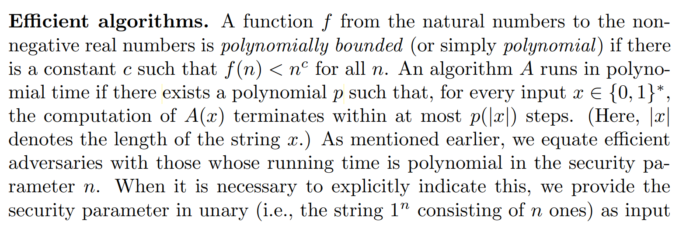
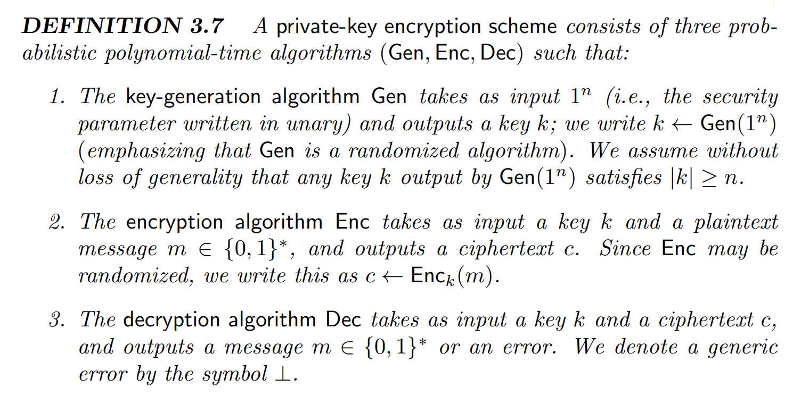

# Lec3 Computational Security

!!! info "Abstract"

    在了解了完善保密加密后，我们发现它最大的问题在于密钥至少要与明文一样长。因此我们设想另一种安全定义，它是被放宽的，牺牲了无条件下的安全性，以此获取更短密钥下的可实现性。

    故，这两节的目标集中在如何定义和实现这种安全上。本节偏重于基础的前置知识的补充和定义。
    
    Key words: Computational Security; Poly-time ; OWF

**Goal:** Propose a proper security Notion that can be achieved with "**Short**" secret key.

## 计算安全概述

假设敌手拥有无限计算能力的安全方案叫“信息理论安全”，即上一讲提到的“完美安全”。对应的，计算安全指的是只要攻破该加密方案所需的计算量很大，这个级别的安全就足够了，它明显比信息理论安全弱。并且计算安全强依赖于不能被证明的假设，而信息理论安全完全不需要。

> 任何对密码学构造方法的计算安全的无条件证明，都需要证明$P\neq NP$.

### 两个放宽条件：

+ Relaxition1：Attacker's computational power is bounded.

仅仅在对抗"Efficient"的敌手时，安全性存在。"Efficient"指的是在可行的时间内运行

+ Relaxition2:   Advantage is small.

敌手潜在成功概率非常小

### 两种实现方法

#### 具体方法

通用的定义是：一个方案为$(t,\epsilon)$安全，如果每个运行时间最多为$t$的敌手以最多为$\epsilon$的概率成功攻破该方案，但不是讨论的重点，不是书中用到的方法

#### 渐进方法

对于两个放宽条件，具体的实现是通过复杂性理论中的渐进方法完成的。我们将引入安全参数$n$，把敌手的运行事件以及成功概率视为$n$的函数。具体地说：

- “可行的”、“有效的”等价于以$n$为参数的多项式时间内运行的概率算法
- "小的成功概率"等价于小于任何以$n$为参数的多项式倒数

渐进方法的优点是不需要依赖于任何特定假设，并且把渐进安全的保证转换为具体安全的保证是相对简单的。

渐进方法下的通用定义是：如果每个 PPT 敌手以可忽略的概率成功攻破一个方案，那么该方案是安全的。

## Definition of Asymptotic Approach 

### Definition of Efficient

#### Def(Deterministic Algorithm)

A deterministic algorithm is a turing machine with an input tape and an output tape

#### Def(running time)

let $M$ be a turing machine, we say the running time of $M$ is $T$ if  $\forall x\in \{ 0,1 \}^{*}$,

$M(x$) will halt in at most $T(\lvert x\rvert)$ steps

#### Why Polynomial so important

$$
P \neq NP
$$

这揭示了多项式的多个性质：

1. Language Independent: 语言转换后(java -> C)仍是Poly的
2. composition: 任意Poly的组合仍是Poly的，$eg: Poly \times Poly = Poly$
3. Natural: 经典算法都是Poly-time的
4. Slow-growing: Long term时间内，增长缓慢

从Poly的重要性中，自然地引出 **Poly-time Running Time**定义

#### Def(Poly-time Running Time)

Running time of $M$ if Polynomial if $\exists$ a const $c$,$\forall x\in \{0,1\}^*$,$M(x)$ will halt in $\lvert x \rvert^c$ steps.

### Definition of Negligible

同时，negl函数具有技术上的良好性质：

举几个negl(n)的例子：$2^{-n},2^{-\sqrt{n}},2^{-\log n}$

---

至此，可以更新渐进方法下的通用安全定义如下：

如果每个概率多项式时间的敌手$A$执行某个特定类型的攻击，对于每个多项式$p(\cdot)$，存在一个整数$N$，对$n> N$，$A$在这次攻击中成功的概率小于$\frac{1}{p(n)}$，则这个方案是安全的。

## Definition of Computational Secure

基于完美安全的定义基础上，计算安全引入了安全参数$n$，所以我们需要结合$n$对加密的语法再做一次定义

小结：

$Gen(1^n)\rightarrow sk$

$Enc(m,sk)\rightarrow c$

$Dec(c,sk)\rightarrow m$

---

## One way function

> Onewayness: $x \rightarrow f(x)$ is easy,while $f(x) \rightarrow x$ is hard.

Let "f" be a function that maps $\{0,1\}^* \rightarrow \{0,1\}^n$，we say "f" is an one-way function If

1. **Easy to Compute**: $\exists$poly-time $M$, $\forall x\in \{0,1\}^*$,that $M(x) = f(x)$

2. **Hard to Invert:** 对于 **Hard to Invert**,下面有三种不同程度的定义

### Worst-case One way function

 $not\exists$ efficient Randomized Adversary,$\forall x\in \{0,1\}^*,Pr[A(f(x))=t:f(t)=f(x)]=1$.

显然这个定义是非常宽松的，因为它只要求敌手不能攻破所有的x，即使有一部分x被攻破，也会被认为是安全的。

### Strong One way function

> 默认是强定义

想要加强定义，需要在等式中引入x的分布约束，但是x是任意长字符串，空间是无穷的，无法通过直接定义
$$
\forall A,\Pr\limits_{x,r} [A(f(x))=t:f(t)=f(x)]\leq small 
$$
来实现。又因为   $\{0,1\}^*=\{\{0,1\}^1,\{0,1\}^2,\cdots ,\{0,1\}^n,\cdots\}$

通过安全参数n，可以把x分割为有限空间，这样就可以引入x了，故强定义为：
$$
\forall n,\Pr\limits_{x,r,x\leftarrow \{0,1\}^n}[A(f(x))=t:f(t)=f(x)]\leq small
$$

#### 如何定义small

定义一个小量是困难的，自然地，我们会想到通过$small=\frac{1}{big}$，通过一个足够大量的倒数来获得small

在这里，我们把这个大数取为 **super-poly**

**super-poly**:超多项式级，如$2^n$,$n^{\sqrt{n}}$,$n^{logn}$

**Def**: we say a function is super-poly if for any const c,$\exists N,s.t.$ for any $n\geq N$,$f(n)\geq n^c$

这显然可以和我们在渐进方法中定义的 $negl(n)$产生关联，即 $small = negl(n)$

上面的强定义也就可以修正为：
$$
\forall n,\Pr\limits_{x,r,x\leftarrow \{0,1\}^n}[A(f(x))=t:f(t)=f(x)]\leq negl(n)
$$

### Weak One way function

> 比较复杂，只做了解即可

在强定义中，条件过于苛刻，因为它要求每个x被攻破的概率很小。实际实现上，往往采用折中的方法，即定义一个Weak one way function,让被攻破的概率在小于某个值时是可以接受的

$$
\exists poly,s.t.\forall PPTA,\Pr\limits_{x,r}[A(f(x))=t:f(t)=f(x)]\leq 1-\frac{1}{poly}
$$

这样就把概率限制在了不是那么小的范围内了

**eg**:

$$
F(x,y)=\left\{
\begin{aligned}
xy\quad &if\quad x\neq1 \&y\neq1  \\
1\quad &if\quad x=1 |y=1 \\
\end{aligned}
\right.
$$

当x,y取大素数时，就变成了大数分解问题，这就是一个Weak One way function

### Further Discussion

有些地方并不Care所谓强弱，比如教材对于难以求逆的定义是：
$$
\Pr\limits_{x\leftarrow \{0,1\}^n}[A(f(x))\in f^{-1}(f(x))]\leq negl(n)
$$
但显然，它引入了函数$negl(n)$，属于上面三种定义中的 “强定义”