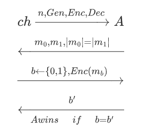
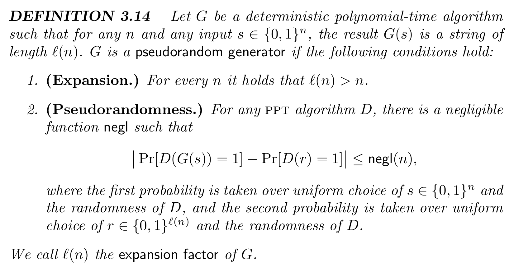
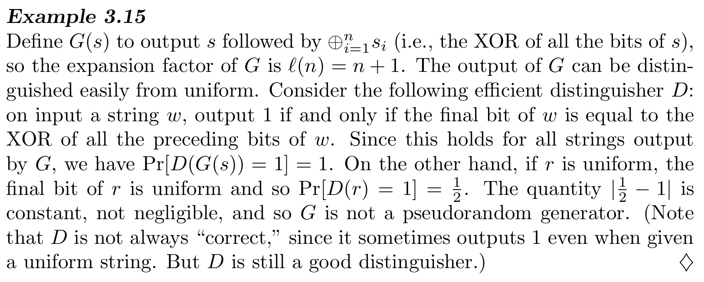
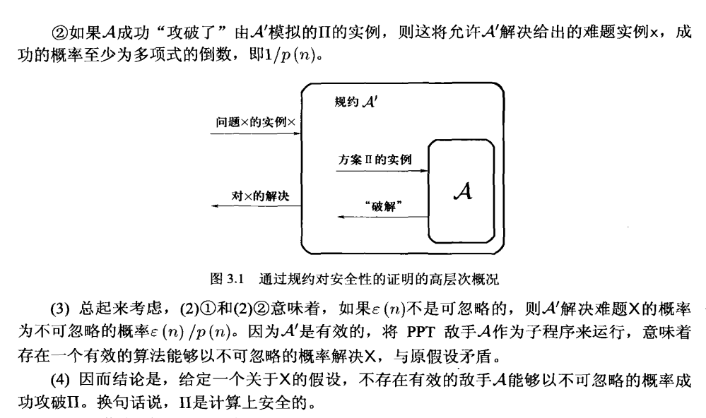
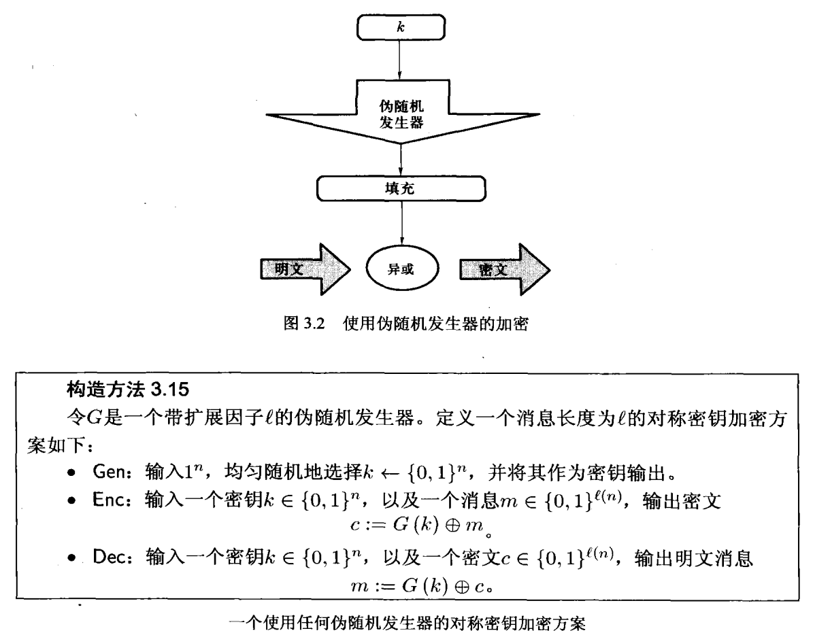
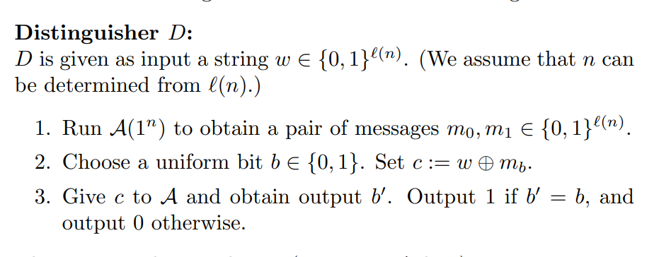
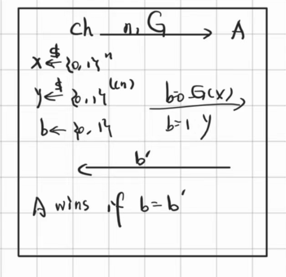
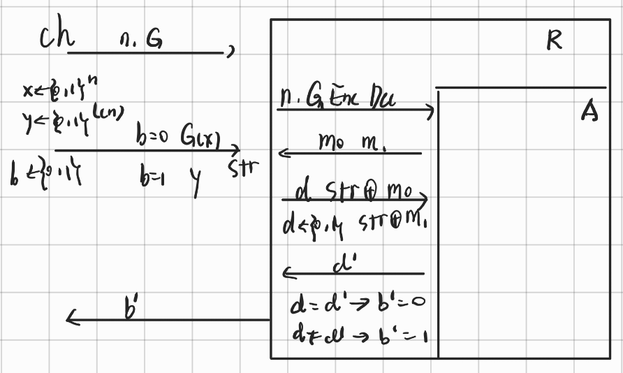
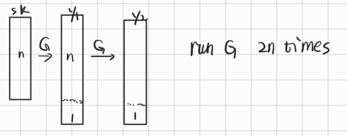

# Lec4 EAV-Security

!!! info "Absract"

    在第三讲中，已经完成了前置知识的介绍，这一讲将集中于我们的主要目标
    
    **Goal**: How To Design a Secure Cryptosystem with Shorter Secret Key.
    
    逻辑上，会先构建单消息加密下的模型EAV-secure(引入PRG);随后讨论更强的多消息加密模型CPA-secure(引入PRP/PRFs).
    
    其中，单消息加密的构造也被称作流密码，多消息加密的构造也被称作分组密码,本节讲流密码
    
    Key Words: EAV-Secure;pseudo-random; PRG; Stream Cipher; 

## EAV-Secure

前面提到过，我们在定义一种安全时需要考虑两个要素：

- 敌手的能力
- 安全目标，即对“攻破”的定义

对于前者，EAV-Secure下的敌手只能**窃听单条消息**，且**计算能力被限制在多项式时间内**。对于后者，定义的难度就比较大。具体地说，我们需要形式化处理 “敌手不能从密文中获得任何有关明文的信息”。已知在**语义安全**的定义下，是能够成功做到形式化处理的，但是难度很大，很复杂。幸运的是，我们可以利用另一个**完全等价**(教材中有证明，此处略)的定义，即 **Indistinguishability**（不可区分性）。这个概念在完美安全处已经提及过，对于计算安全情景下，基于它做一个修正即可。

这其实和计算安全定义下的两个Relaxation是一致的。还有两个实验上的主要区别，一是引入了安全参数$n$，此时，不可区分实验就变成了一个关于$n$的函数，另一个就是要求实验输入的$m_0,m_1$必须等长。

### 计算安全下的不可区分实验定义

### EAV-Secure 安全性定义

#### 另一种等价定义

上面一种定义是说对于所有PPT敌手$A$，都不能区分出由哪个信息加密而来；下面的定义阐述的是，每一个敌手的行为是相同的，即不论$b=0$或$b=1$，敌手输出1的概率都是一样的：

## Pseudo-random Generator

> PRG是构造EAV安全的重要工具

$sk$ is Truly random; $str$ is Random looking.

From Theoretical Perspection:

1. The running time of adv.
2. The size of "string".

### Definition: (Pseudo-Random Generator)[PRG]

Let $\{G_n\}_n$ be a function that maps $\{0,1\}^n \rightarrow \{0,1\}^{l(n)}$

we say $G$ is a PRG if

1. $l(n) > n$
2. let $X_n$ be the ensemble "induced from" $G$,let $Y_n$ be the ensemble of uniform distribution on $\{0,1\}^n$

​	we have $\{X_n\}_n \approx \{Y_n\}_n$

>1.代表扩展性 2.代表伪随机性，2的等价定义为:
>
>对所有概率多项式时间的区分器$D$来说，存在可忽略的函数$negl()$满足
>$$
>\vert Pr[D(r)=1]-Pr[D(G(s))=1]\vert \leq negl(n)
>$$
>其中，$r$是从$\{0,1\}^{l(n)}$中均匀随机选择的，种子$s$是从$\{0,1\}^n$中均匀随机选择的，并且概率来源为$D$的随机性和对$r,s$的选择
>
>$l(\cdot)$也称为$G$的扩展系数

**Definition in the book**

??? note "An Example of PRG"

    

### Further Discussion of Pseudo-Random

伪随机发生器的性能实际上并没有预期的好。考虑$l(n)=2n$，此时对于$\{0,1\}^{2n}$的均匀分布，$2^{2n}$中每个字符串被选择的概率为$2^{-2n}$;对于$G$生成的伪随机分布，因为$G$接收长度为$n$的输入，不同可能字符串最多有$2^n$个，所以目标字符串（长度为$2n$）在其中的占比只有$2^n /2^{2n}=2^{-n}$，这说明大部分字符串不会作为$G$的输出。

比较显然，对于一个指数时间的区分器$D$，很容易能区分出随机字符串和伪随机字符串。但是因为我们只考虑多项式时间的Adversary,它还是比较安全的。

#### 伪随机发生器的存在性

进行了这么多理论上的分析，更重要的问题是它真的存在吗？

教材认为，基于“单向函数是存在的”这个假设，伪随机发生器是存在的。

只要数学上存在没有已知有效算法解决的困难问题，如大数分解，伪随机发生器就能依赖于这个假设被构造出来。

---

## 计算安全下的归约方法

由于下面要开始用PRG构造EAV-Secure,重新具体地表述一下归约方法：

## Construct EAV-Secure by PRG

> 其实就是对One-Time Pad 做修改

### 加密方案

我们给出加密方案如下：

### 安全性证明

$Theorem$: Let $\pi =(Gen,Enc,Dec)$ be a stream cipher,$\pi$ is EAV-secure under the Assumption that $G$ is $PRG$.

用归约证明核心定理，该定理说明了此构造方案的安全性

#### 区分器

先定义一个区分器$D$，后面归约时会用到

示意图：

Define:
$$
Adv(A)=P[Awins]-\frac{1}{2}
$$
we say $G$ is $PRG$ if $Adv(A)$ is small.

#### 归约方法

By contriposition:

​	if $\exists$ an efficient adversary $A$ breaks EAV-secure, then we can build a Reduction $R^A$ that breaks the Pseudo-Random.

​	Constuct a security game:

$$
\begin{align}
Pr[AwinsEAV]&=\frac{1}{2}+\Delta \\
Pr[R^AwinsPRG]&=P[b=0]\cdot Pr[R^Awins \mid b=0]+P[b=1]\cdot Pr[R^Awins \mid b=1]\\
&=\frac{1}{2}Pr[R^Awins \mid b=0]+\frac{1}{2}\cdot \frac{1}{2}\\
&=\frac{1}{2}Pr[AwinsEAV]+\frac{1}{2}\cdot \frac{1}{2}\\
&=\frac{1}{2}\cdot (\frac{1}{2}+\Delta)+\frac{1}{4}\\
&=\frac{1}{2}+\frac{\Delta}{2}\\
&Q.E.D\\
&\Delta:NonSmall\\
\end{align}
$$

非常巧妙的归约方法，借助于R，假设$A$能攻破$EAV$，推出$R^A$能攻破$PR$，(攻破即$Adv(A)$较大，就是证明中的NonSmall)

## Stream Cipher

> EAV-Secure下的应用

对于EAV-Secure下的Construction:

$Gen(1^n)\rightarrow sk\leftarrow \{0,1\}^n$

$Enc(sk,m)\rightarrow G(sk)\oplus m$

$Dec(sk,c)\rightarrow G(sk)\oplus c$

这种构造方式(加密方案)就叫做 **Stream Cipher**，即流密码。它完全脱胎于 **One Time Pad**，即加密过程依赖于异或操作，它的特点是首先生成一个伪随机比特流，然后让该比特流与明文做异或运算。

!!! note "流密码操作模式"

    流密码的操作模式分为 **同步** 和 **异步**，仅作了解即可.流密码可以用PRG构造（即本节内容）也可以用PRF构造（不做要求）
    
    形式化的定义为：
    
    

### Longer N

上面的构造方法把密钥从$n$扩展到$l(n)$，这个扩展的长度是定的。我们自然可以想到是否有可变扩展长度的构造方案。在这里，我们讨论的就是这个问题:

Given a $G$ maps $\{0,1\}^n \rightarrow \{0,1\}^{n+1}$, Design $G^{\prime}$ maps $\{0,1\}^n \rightarrow \{0,1\}^{2n}$

> 这种构造方法被称为长度可变的伪随机发生器，它的定义为：
>
> 1. 令$s$为一个字符串，整数$l >0$,则$G(s,1^l)$输出一个长度为$l$的字符串
> 2. $\forall s,l,l^{\prime}$,$l<l^{\prime}$,字符串$G(s,1^l)$是$G(1^{l^{\prime}})$的前缀
> 3. 定义$G_l(s)=G(s,1^{l(\vert s\vert)})$,$\forall l(\cdot)$,有$G_l$是一个扩展因子为$l$的伪随机发生器

解决的方法很简单，就是跑$2n$次的$G$，最后把每次扩展的1个bit拼接成$2n$个bit即可。难点在于证明，在大于1的运行中，输入的$n$本身是伪随机的，我们需要证明伪随机的这$n$个bit映射后仍然是伪随机的，并且满足无法区分性，即
$$
Game0 \approx Game1 \approx Game2 \cdots \approx Game2n
$$

证明方法类似前面，利用归约证明。但过于复杂，讲义上也没做要求，就不证了

### Weakness

前面提到，Stream Cipher派生自One Time Pad，那么它自然也继承了One Time Pad的弊端，即它的密钥是唯一的.对于
$$
sk\oplus m_1=c_1\\
sk\oplus m_2=c_2
$$
由异或的性质
$$
c_1\oplus c_2=m_1\oplus m_2
$$
显然泄露了额外有关明文的信息，它是不可靠的.

对于这个问题，将在下一讲中对多信息情境下的安全性给出构造方案与证明.
