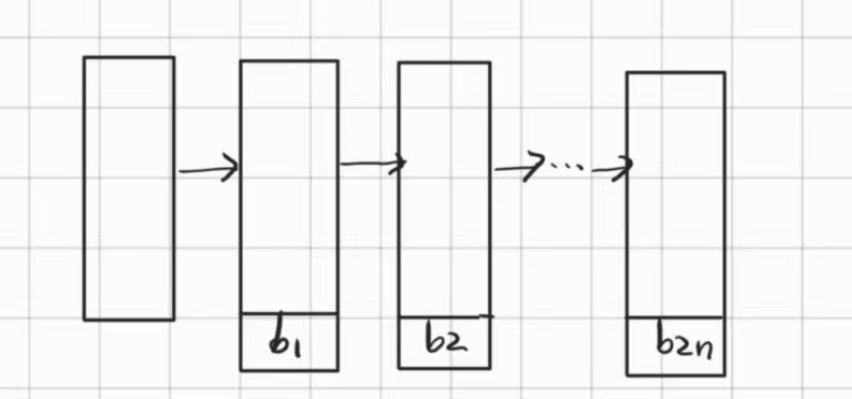
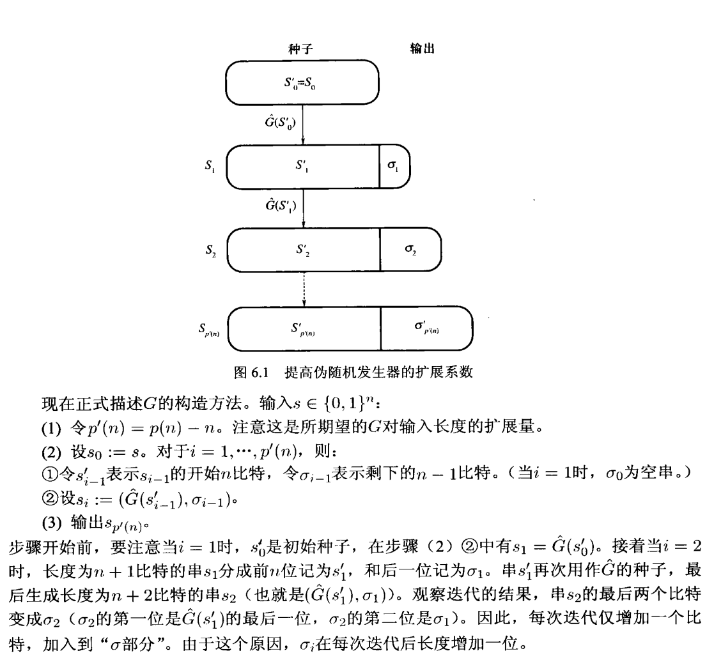
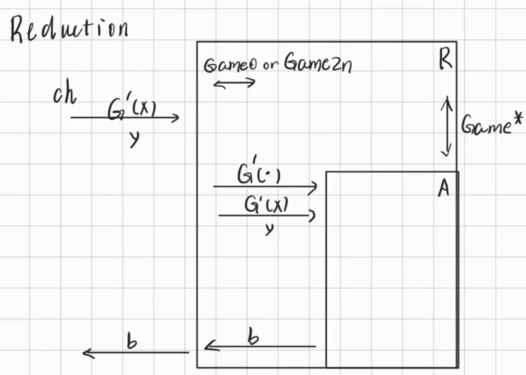
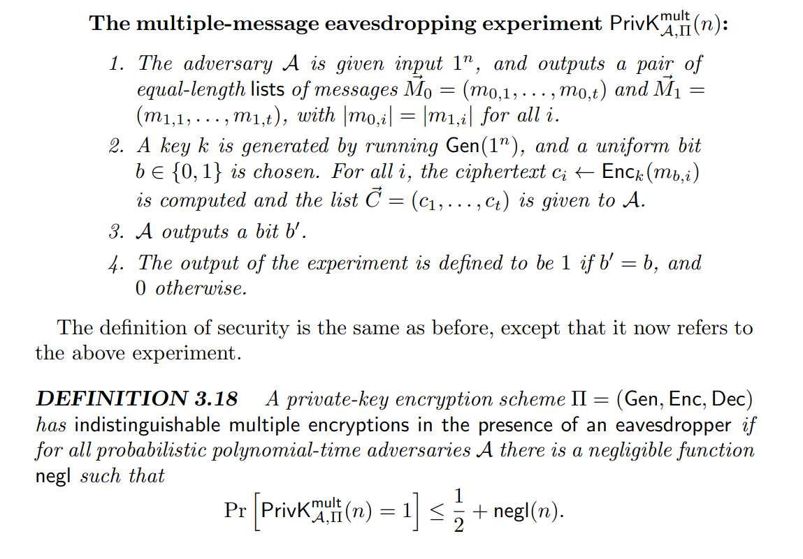
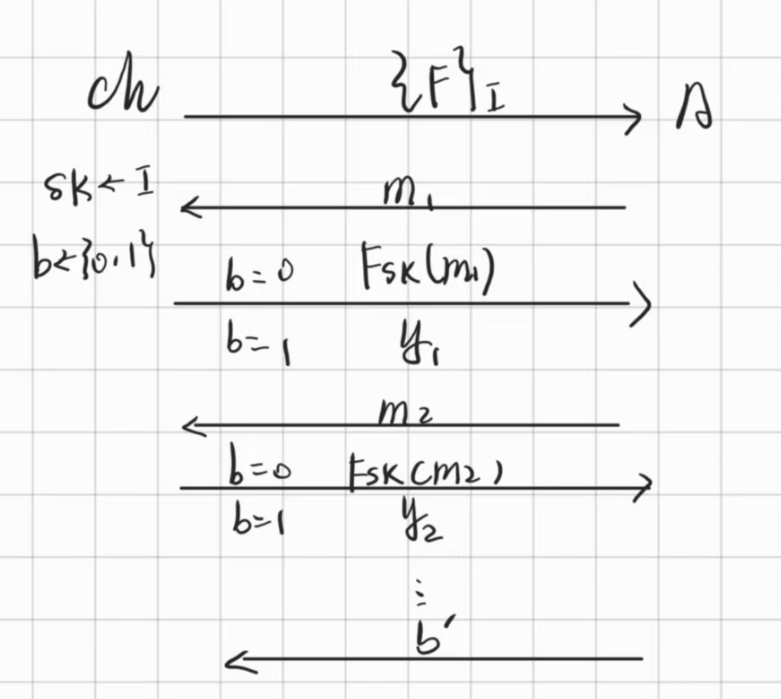

# Lec5 Multi-Message Security

!!! info "Abstract"

    本讲中，首先补充了Poly-size extension PRG的构造与归约，再引入了Multi-Msg Security的概念，介绍了伪随机函数PRFs，它是构造Multi-Msg Security的重要工具。

    Key words: Poly-size extension; Multi-Msg Security; PRFs

## PRG with any poly-size bits extension

Let $G$ be a PRG that maps $\{1,1\}^n \rightarrow \{1,1\}^{n+1}$, we construct a new PRG $G^{\prime}$ that maps $\{1,1\}^n \rightarrow \{1,1\}^{2n}$

$$
G^{\prime}=b_1 \mid \mid b_2\cdots\mid\mid b_{2n}
$$

!!! note "书中6.4.2的描述"

    

 $Theorem$: $G^{\prime}$ is a PRG under the Assumption that G is a PRG.

下面需要设计一系列Game，基本思路是让攻击者判断由$G^{\prime}$生成的密文与纯随机方式生成的密文，若无法判断，则证毕

Game0的目的是验证$G^{\prime}$的伪随机性，比较直接的方式是让它的结果与一个完全随机的字符串$\{0,1\}^{2n}$一起输入给A，让A判断。但是这里并没有这么做，而是选择模拟1bit拓展的过程构造了Game1到Game2n，最后在Game2n中得到了一串完全随机的字符串（每一个bit都从$\{0,1\}$中随机选取）在最后的Reduction中，我们让ch和R进行Game0 or Game2n,让R与A进行Game*

### Reduction

到最后只需证：
$$
Pr[A\Rightarrow1\mid Game0]\approx \cdots \approx Pr[A\Rightarrow \mid Game2n]
$$

> 其中，每两项的gap $\Delta \leq \epsilon$ ,那么有 gap of Game0 and Game 2n bound in $2n\epsilon$ 
>
> 从这里也可以看出，extension of PRG is at most Poly times, or the gap might be large.
>
> 具体证明见6.4.2

## Multi-msg Security

如上一讲提到的，Stream cipher 继承了 One Time Pad 的所有缺点，即它也是 One time 的，这意味着无法对多条信息进行加密。更本质地说，EAV-Secure解决了单消息通信下的安全，然而现实中在一次通信是会有很多信息，我们也需要保证多信息下的安全。

在Multi-msg Secure中，我们引入的攻击者模型是选择明文攻击，即攻击者可以选择明文m输入，而不是被动窃听。

### 多信息下的窃听不可区分实验

.png)

### Necessity of probabilistic encryption.

下面证明Enc函数若采用确定性算法不可能实现Multi-msg Security.

反证法：如果Enc是确定性的，那么A可以构造$M_0=(M_{01},M_{01}),M_1=(M_{11},M_{12})$,其中，$M_0$中的两条信息是相同的，$M_1$中的两条信息是不同的，根据确定性，密文$C_0$中的两条密文也是相同的，$C_1$中的两条密文是大概率不同的，根据密文是否相同就可以很简单地判断出加密的到底是$M_0$还是$M_1$了

综上，在选择明文攻击下，我们必须选择随机性的加密算法，即当相同的信息被加密多次时，每次都产生不同的密文。看起来不太可能实现，因为解密必须要总能恢复信息，关于具体实现和理论，后面会进行解释。

## Pseudo-Random Functions(PRFs)

### Why not Random Functions

定义一个函数族$Func_n(\cdot)$ = $\{F_1 (),F_2(),\cdots ,F_t()\}$, $F_i()$是满足映射条件$\{0,1\}^n\rightarrow \{0,1\}^n$的函数，我们希望获得纯随机性的加密算法，最naive的想法是加密时从这个函数族中随机均匀地抽一个函数出来。但是，考虑这个函数族的大小，由于函数$F_i()$是从$\{0,1\}^n$到$\{0,1\}^n$的映射，定义域的大小是$2^n$,可以把函数映射关系想象成一张表，那么这张表一共有$2^n$行，每行$n$bits，那么这张表总的大小为$n\cdot 2^n$，也就是说一个函数可以表示成一个长度为$n\cdot 2^n$的字符串。再考虑函数族的大小，相当于是所有长度为$n\cdot 2^n$的字符串的数量，从而:

$$
\begin{align}
&size(Func_n(\cdot))=t=2^{n\cdot 2^n}\\
&size(sk)=\log t=n\cdot2^n
\end{align}
$$

这个size是指数级的，是不“有效”的，所以单纯随机均匀选取是不太理想的。我们需要通过伪随机来重新定义PRFs.

这也就说明了伪随机需要实现的目标：没有多项式时间的敌手能够区分$F_{sk}()$和$f$，前者的$sk$是从$\{0,1\}^n$中随机均匀选取的，后者的$f$是从函数族中随机均匀选取的

> We assume that F is **length preserving**, meaning $l_{key}(n) = l_{in}(n) = l_{out}(n) = n$.

### Definition

> 注意，不能用PRG中的伪随机定义来定义PRF，因为PRF的长度是指数级的，而D只有Poly的计算能力，所以D没有足够的时间去检查它的输入PRF，所以在上面的定义中，给D加上了访问预言机的能力。

Let $\{F\}_I$ be a family of function index by $I$, we say $\{F\}_I$ is Pseudo-Random if the following security game hold:

这个游戏做的是：

$b=0$时，从$\{F_1,F_2,\cdots,F_I\}$中选,$size=I$；$b=1$时，从函数族$G_{sk}(\cdot)$中选，$size=n\cdot 2^n$.然后让A判断加密用的是从哪里选出来的函数，若无法判断正确，证明这个函数是伪随机的。

> 在下一讲中，将使用PRFs去构造实现Multi-msg Secure的方法，并从理论上证明$PRG \Leftrightarrow PRFs$

#### PRFs的存在性

理论上可以证明，当且仅当PRG存在，PRFs存在。因此，PRFs可以基于任何困难问题构造。