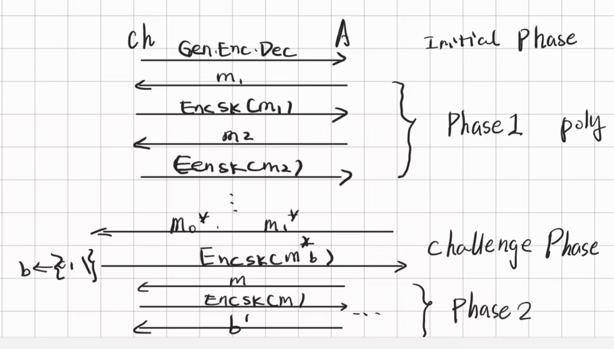
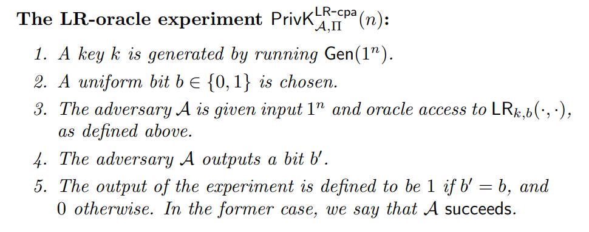
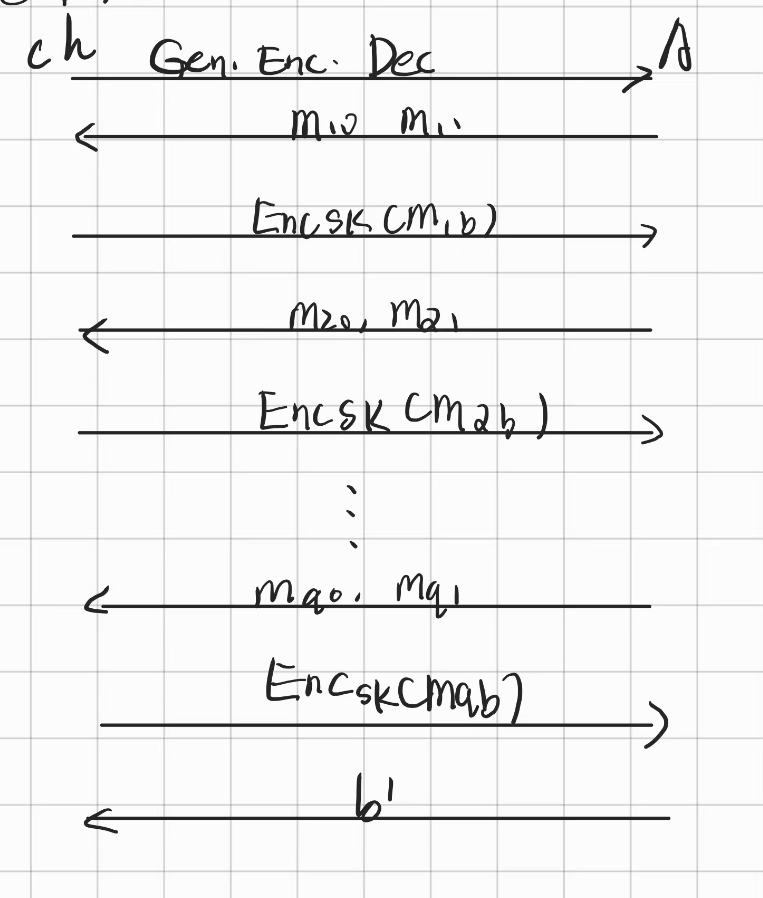
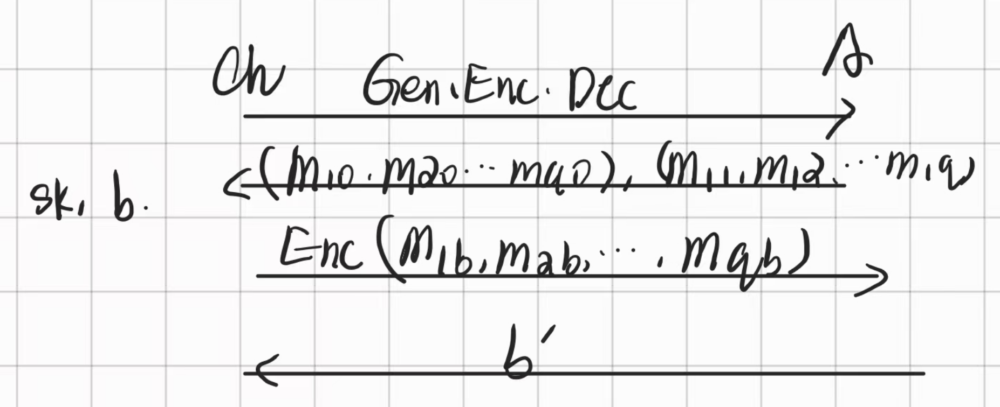
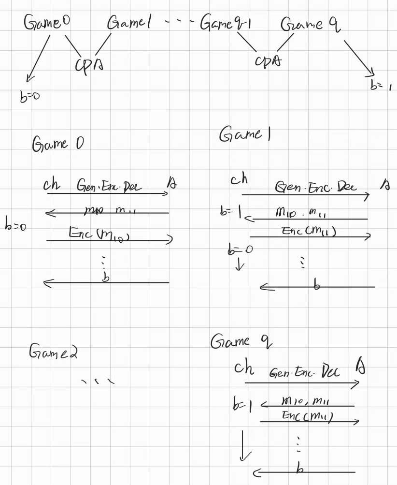
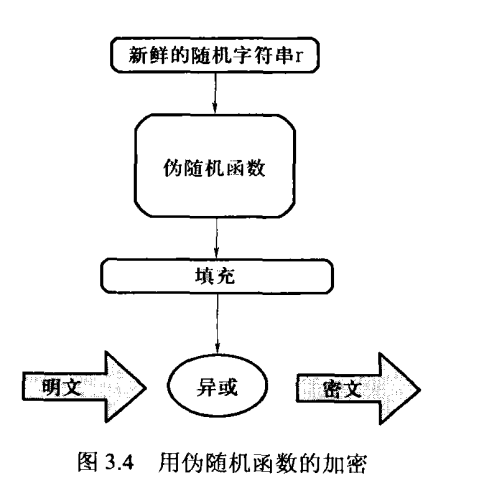
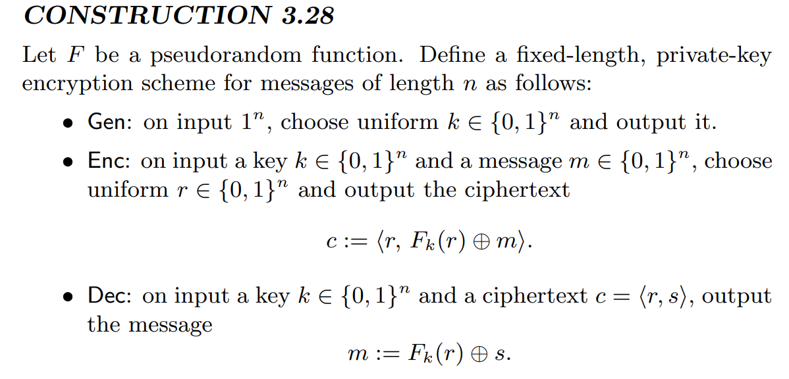
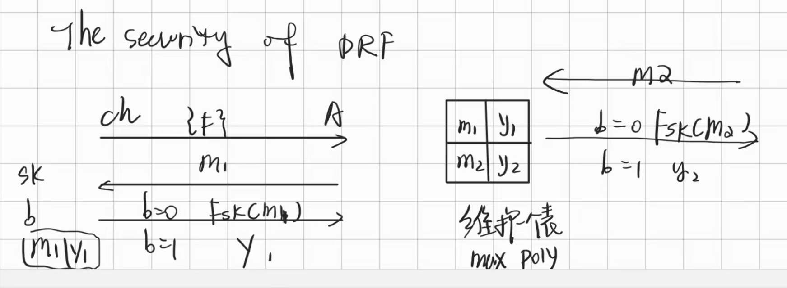
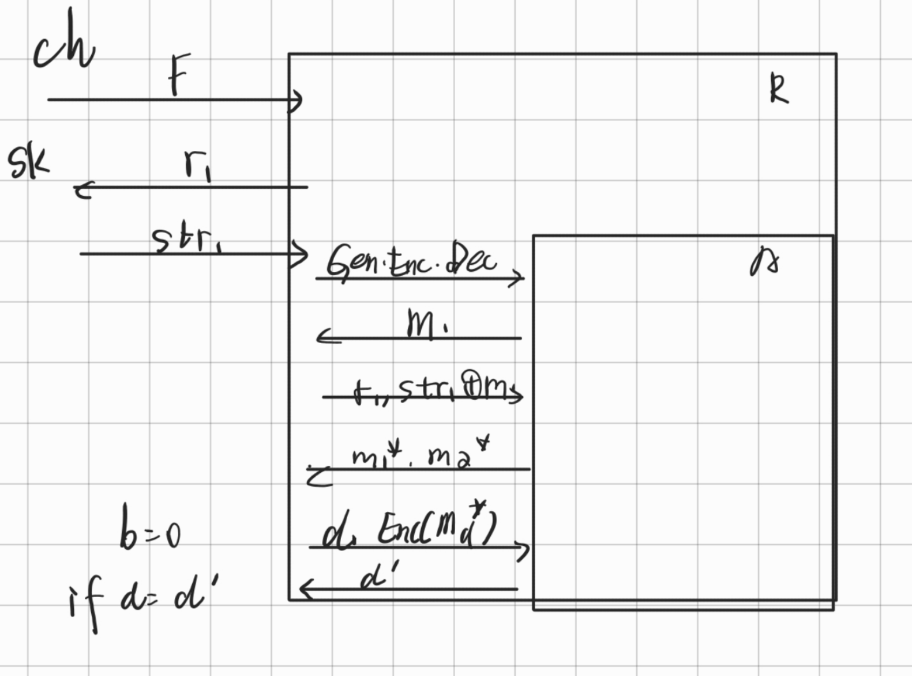

# Lec6 CPA-Security

!!! info "Absract"

    本讲中，延续上讲讲过的PRFs，对Multi-msg Secure进行讨论，同时介绍了一种重要的攻击：选择明文攻击（IND-CPA）。

    **Goal**: Build a cryptosystem that yields Multi-Msg Secure.

    本讲的核心逻辑是：

    1. 证明CPA的变种CPA2(强于CPA) $\Rightarrow$ Multi-Msg Secure.
    2. 证明CPA $\Rightarrow$ CPA2.
    3. 用PRFs构造CPA.

    通过这条逻辑链，我们就实现了用PRFs yields Multi-Msg Secure.

    Key words: Multi-Msg Secure; IND-CPA; PRFs

## IND-CPA(选择明文攻击)

> Indistinguishable-Chosen-Plaintext Attack.

### CPA-Security

#### Encryption oracle

加密预言机，相当于一个**黑盒**，若攻击者有访问预言机的能力，那么他可以输入一个信息并获得处理后的结果。当$A$询问预言机并提供一个明文消息$m$作为输入时，预言机返回一个密文$c\leftarrow Enc_{sk}(m)$作为回复。当$Enc$是随机的，则预言机每次回答一个询问时，都会保证新的随机性。

#### The CPA indistinguishability experiment

$Def$:

### CPA-secure for multiple encryptions

**下称CPA2**，是CPA的一个变种，它给予了敌手访问$LR$预言机的能力。

#### LR-oracle

相当于一个Challenge Phase,敌手在每次访问时都能发两条消息，预言机会随机加密其中一条并返回

图示：

#### 安全性定义

---

下面开始我们逻辑链条的搭建

### CPA2 $\Rightarrow$ Multi-Msg Secure

Recall the Definition of Multi-Msg-Secure, 

对于这个结论，我们不作严谨证明。考虑CPA2的定义，它代表的Adversary具有相当于能够根据上次密文选择下一次的明文的能力，也就是他选择明文的能力是 **Adaptive** 的，而相比起来，Multi-Msg Secure 中的Adversary只能一次性发完所有明文，即后面的信息必须在第一次发送前就产生好。显然，在CPA2下安全的定义可以得到在Multi-Msg Secure定义下的安全，即CPA2 $\Rightarrow$ Multi-Msg Secure.我们逻辑链条的第一步达成。

### CPA $\Rightarrow$ CPA2

The Power of A in IND-CPA can be **trivially simulated** in CPA2.

.png)

可以看到在直觉上CPA$\Rightarrow$ CPA2是很自然的，只要把phase1,phase2中发送的能得到确定密文的单条信息用CPA2中多个Challenge phase发两条相同信息来代替即可。形式化地，一个敌手能访问LR-oracle，他就可以用$LR_{k,b}(m, m)$来模拟普通的预言机。

但是问题在于，这又是一个由少到多、由弱到强的证明，因为CPA只有一个challenge的机会，而CPA2有无穷的challenge机会，我们之前在证明PRG的指数扩展的时候也遇到过，是相对困难的。这时候，就可以再次请出强大的工具： **Hybrid argument**，用它来实现多项式个小片段证明的链接。

这个构造是非常巧妙的。前$i$个challenge用$b=1$处理，其余用$b=0$处理，相邻的Game相当于只有一次Challenge的区别，就相当于CPA,而最终的Game0和Gameq恰好相当于所有的信息对都是在做Challenge,这就成功地从多个CPA，链接、构造到了CPA2。至此，我们逻辑链条的第二步达成。

### Why IND-CPA?

> 对于CPA和CPA2都成立

#### Arbitrary-length Encryption

In One Time Pad,We must keep $\vert M\vert = \vert K\vert$,that means we only can encrypt the $m$ of the **fixed length**. By using IND-CPA, We can  achieve encrypt all the messages of $M=\{0,1\}^*$. 

 In particular, given any CPA-secure fixed-length encryption scheme $\Pi = (Gen, Enc, Dec)$, it is possible to construct a CPA-secure encryption scheme$\Pi^{\prime} = (Gen^{\prime} , Enc^{\prime} , Dec^{\prime})$ for arbitrary-length messages quite easily.

假设$\Pi$中的$Enc$只能加密一个bit,那么对于长度为$l$的信息$m$：

$$
m=m_1 \vert\vert m_2 \cdots \vert\vert m_l
$$

我们可以利用CPA构造加密函数$Enc^{\prime}()$:

$$
Enc(m)=Enc(m_1) \vert\vert Enc(m_2) \cdot \vert\vert  Enc(m_l)
$$

> 但是在同一个challenge phase 中，我们一般还是要做到两条信息等长

#### Further Discussion

无论在EAV-Secure还是IND-CPA下，Adversary只知道密文$c$的长度，不知道其他有关明文$m$的任何额外信息。回忆香农安全的定义：Adversary不会知道任何有关明文$m$的额外信息。那么我们自然要问，只泄露长度，是否可以接受？

答案是可以。因为对于任意确定性算法，要么无法隐藏长度，要么要使用非常大（一般是指数级的）Cost，还要指出的是，如果隐藏了原文长度，在理论上不可能实现对任意长度的加密。并且在实际应用中，长度在很多情况下确实并没有多关键。

那么我们可以进一步回答为什么IND-CPA在现实应用中这么重要的原因，它是在攻击者只能窃听（这里用窃听其实并不准确，因为攻击者完全可以选择明文，这里想表达的是攻击者无法篡改交流和加密过程）的情况下，保证efficiency下，能够做到最好的一种安全定义。

## Use PRFs achieve IND-CPA

这是逻辑链条的最后一步，我们预期实现：

**Goal:** how to build an IND-CPA Scheme in PRFs

> 即构造一个CPA安全下的定长加密方案，对于任意长度的加密方案，将在后面的加密操作模式中讨论

首先要明确PRFs到底应该如何用来加密

> 一个Naive的想法是直接定义$Enc_k(m)=F_k(m)$，它的问题在于是确定性的。因此我们必须引入随机性加密算法

即：

$Gen(1^n)\rightarrow sk$

$Enc(sk,m:r):=r,F_{sk}(r) \oplus m$

$Dec(sk,c_1,c_2):=c_2 \oplus F_{sk}(c_1)$

> 其中,r是纯随机的，根据PRFs的性质,$F_{sk}(r)$是满足伪随机的

### The security of PRFs

可以看到，通过维护一张表，我们能保证A用相同的明文访问时得到纯随机的密文是一致的。由于这张表是动态创建的，当A有确实的明文发过来才会记录在这张表上，这种技术我们称之为 **Lazy Sampling**.

### Proof: PRF$\Rightarrow$ CPA

Using Reduction:

> 严格证明略，见书P82

